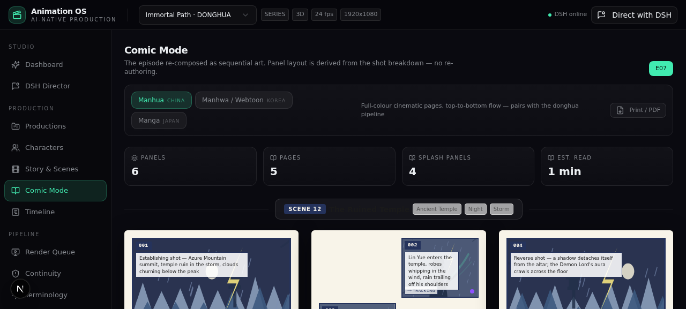
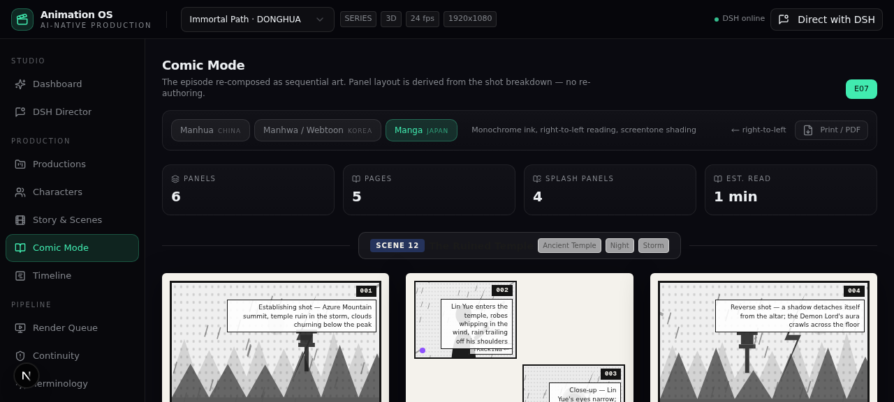
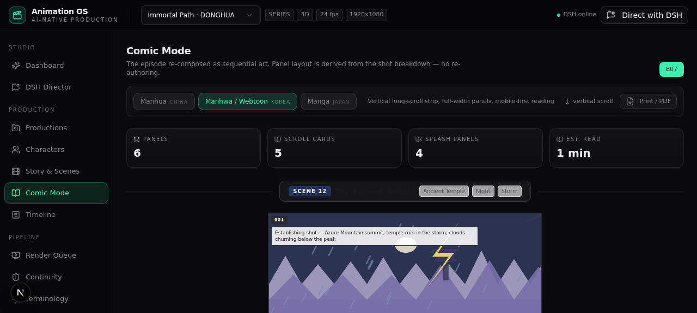
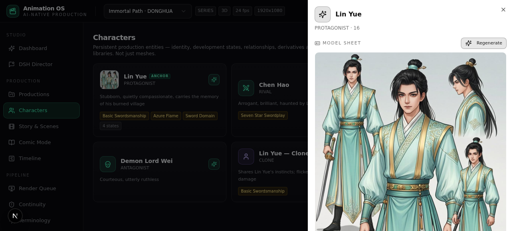
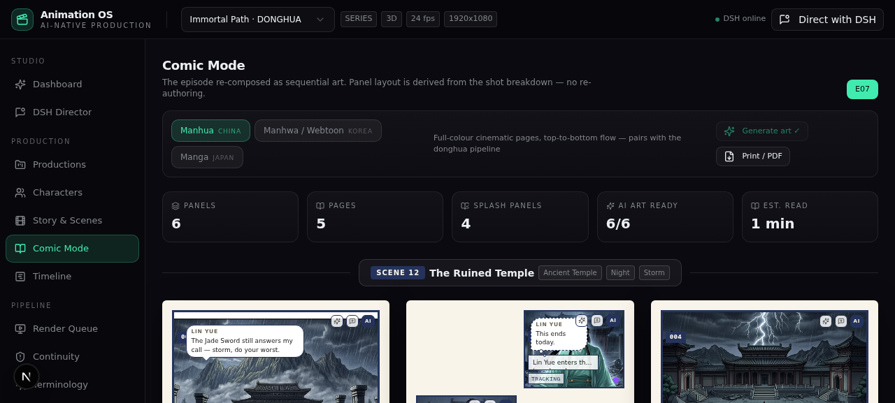
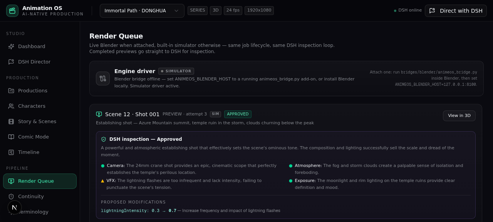
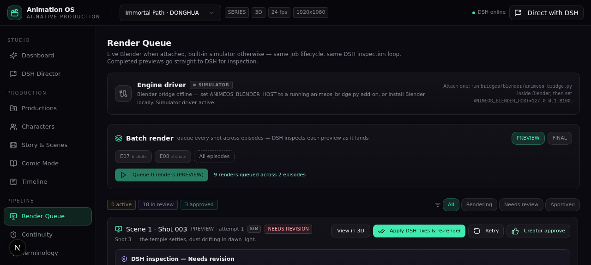
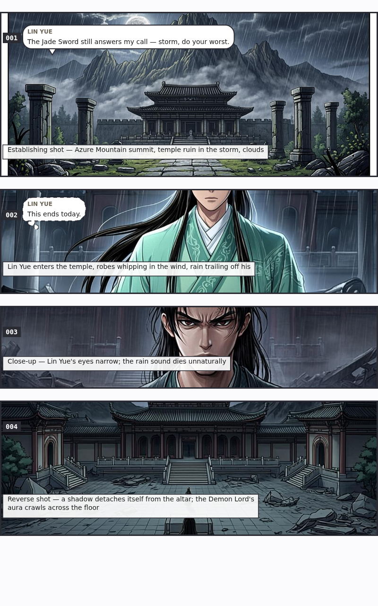

# AnimeOS - AI-Native Animation Production Platform

> **DSH decides · Tools execute · Engine builds · State remembers**

AnimeOS is an AI-native production studio for animated and illustrated storytelling. It natively supports **donghua**, **anime**, **manhua/manhwa (comics)** and adjacent formats through one unified, stateful production pipeline - designed so an AI director (DSH) drives the studio through tools, not ad-hoc chat.

## Core thesis

```
DSH decides → tools execute → engine builds → render → DSH evaluates → revise → approve
```

Every step writes to a persistent production universe: projects, seasons, episodes, scenes, shots, characters (with episode-resolved states), relationships, assets, terminology and continuity events. Nothing lives only in a chat log.

## Feature map

| Area | What it does |
|------|--------------|
| **DSH Director** | 23-tool production API behind a 4-round INTENT → PLAN → EXECUTE → OBSERVE orchestrator. Mid-turn project switching, full execution trace rendered in the console. The director authors **dialogue** (`set_shot_dialogue`), **panel art** (`generate_panel_art`), **character model sheets** (`generate_model_sheet`), the **art style direction** (`set_art_style`) and **scene staffing** (`auto_assign_scene_team` - specialism-aware artist routing + content-matched LoRA attachment, load-balanced) itself. |
| **Render pipeline** | **Live Blender bridge** when attached (jobs submitted over HTTP to the `animeos_bridge.py` add-on, progress polled, frames pulled back), built-in simulator otherwise - same job lifecycle, same LLM render evaluator with *bounded* parameter fixes, apply-fixes → auto re-render, approve → FINAL. **Batch rendering** queues every shot across selected episodes in one click (PREVIEW or FINAL, FINAL shots skipped), with DSH inspections throttled per poll. |
| **Style direction** | Per-production **art style tuning**: a custom style directive (overrides the visual-style preset), palette tokens and extra negative tokens - compiled into every panel-art and model-sheet prompt, tunable from the studio UI or by DSH itself. |
| **Casting consistency** | Per-character **AI model sheets** (turnaround reference images) plus a stored **canonical visual anchor** - the exact prompt tokens re-injected into every panel featuring that character, keeping faces/wardrobe coherent across panels and episodes. |
| **Continuity engine** | Universe-level conflict detection (e.g. destroyed artefact reappearing in Ep 29) with proposed resolutions, plus missing-capability analysis per scene. |
| **Comic Mode** | Shot breakdowns re-composed as sequential art - **manhua** pages, **manhwa/webtoon** vertical scroll, **manga** right-to-left pages. Deterministic panel-layout engine, **AI-generated panel artwork** (style-aware prompts seeded with shot type, environment, weather and character states), **speech-bubble authoring** (speech / thought / SFX, RTL-aware placement), print/PDF export, and **webtoon slice export** - the strip re-rendered at 800px and packed boundary-aware into platform-ready PNG slices, each scored slice carrying an **audio stem** (16-bit WAV, cues re-timed onto the slice timeline) that mixes **real TTS voice renders** for dialogue cues (auto-cast voices, **per-character-state delivery**: AUTO resolves the speaker's episode state, e.g. a battle-damaged Lin Yue reads strained and slow while an excited read rushes at 1.18x) with the synthesized SFX/BGM/ambience beds, plus a manifest with artists, LoRA metadata, voice takes (delivery + resolved state per take) and audio timing, zipped client-side. |
| **Multi-artist studio** | **Style LoRA registry** (per-adapter trigger tokens, strength, base model) with **per-shot fine-tuning** from the panel inspector and **simulated LoRA training runs** distilled from approved panels (live steps, decayed loss curve, milestone log, TRAINED badge) plus a **Train all** batch button that fine-tunes every idle adapter in one pass; an **artist roster** with per-shot assignment, bulk assignment and a **workload-balance view** (production-wide spread badge, per-artist bars, **affinity-first pool distribution**: LoRA-bound panels route to the artist with the highest style affinity for that adapter, unbound panels rotate by load, **per-artist style affinity** scoring which LoRA each artist delivered with); DSH can staff whole scenes autonomously via `auto_assign_scene_team`. |
| **3D cinematic preview** | Three.js procedural MVP scene driven by live scene parameters and shot camera presets (movement-aware), with auto shot advance. |
| **Studio UI** | Dashboard, Productions, Characters (states / relationships / derivatives), Story & Scenes, Comic Mode, Timeline, Render Queue, Continuity, Terminology, History. |

## Screenshots

**Comic Mode** - the same episode re-composed as manhua (LTR, colour), manga (RTL, monochrome + screentone) and manhwa/webtoon (vertical scroll) pages:

| Manhua | Manga (RTL) | Webtoon |
|--------|-------------|---------|
|  |  |  |

**Casting consistency & the live bridge** - Lin Yue's AI model sheet (turnaround anchor), DSH-authored dialogue rendered as bubbles over anchor-consistent AI art, and the engine-driver card:

| Model sheet | DSH-authored art + thought bubble | Engine driver |
|--------|-------------|---------|
|  |  |  |

**Batch pipeline & slice export** - the cross-episode batch render card in the queue, and platform-ready 800px webtoon slices cut from the strip (bubbles, captions, chips re-drawn at export resolution):

| Batch render | Webtoon slice (800px) |
|--------|-------------|
|  |  |

## Native format support

| Format | Pipeline posture |
|--------|------------------|
| **Donghua** | Style preset with zh-CN terminology defaults, cultivation-state character modelling, ink-wash flavoured panel art, xianxia demo universe. |
| **Anime** | Cel-shading posture, anime timing stage in the render ladder, ja-JP terminology defaults. |
| **Manhwa** | Manhwa-inspired framing preset (ko-KR) + webtoon vertical-scroll Comic Mode. |
| **Manhua / Manga** | First-class Comic Mode layouts with correct reading direction (LTR / RTL / vertical). |

## Architecture

```
src/
├── app/
│   ├── api/            # 15 route handlers (projects, characters, scenes, shots,
│   │                   #   render-jobs, dsh, panel-art, character-sheet, bridge, …)
│   └── page.tsx        # single-route studio SPA
├── components/
│   ├── views/          # studio views (dashboard, dsh-console, comic, …)
│   ├── preview/        # three.js cinematic preview
│   └── studio/         # app shell (zustand + TanStack Query)
└── lib/
    ├── dsh/            # tools, prompts, orchestrator, evaluator
    ├── ai/             # art service: panel art + character model sheets
    ├── bridge/         # live Blender bridge (HTTP transport, simulator fallback)
    ├── engine/         # render pipeline (Blender driver ⇄ simulator driver)
    ├── comic/          # deterministic panel layout engine + dialogue model
    ├── continuity.ts   # conflict + capability checking
    └── seed.ts         # "Immortal Path" demo universe
bridges/blender/       # animeos_bridge.py - run this INSIDE Blender
```

**Stack:** Next.js 16 · TypeScript · Prisma/SQLite · TanStack Query · zustand · Tailwind · shadcn/ui · Three.js.

Per the replaceability principle, the render engine is a **pluggable driver**: attach a live Blender (below) or let the built-in simulator drive - the production state machine, queue and DSH evaluation loop are identical.

### Attach a live Blender

```bash
# inside any Blender ≥ 3.x (GUI or headless):
blender -b -P bridges/blender/animeos_bridge.py -- --port 8100
# then point the studio at it and restart the dev server:
ANIMEOS_BLENDER_HOST=127.0.0.1:8100 bun run dev
```

The add-on exposes `GET /status`, `GET /progress`, `POST /render`, `POST /ping` on `127.0.0.1`. AnimeOS maps its tunable scene parameters (fog, lightning, energy, rim light, camera distance) onto bpy equivalents, frames the camera per shot grammar (ESTABLISHING→24mm wide … EXTREME_CLOSEUP→100mm), renders the frame, and reports progress into the same queue UI; the frame lands in `public/renders/`. If the bridge drops mid-job the simulator takes over transparently.

## Run it

```bash
bun install
cp .env.example .env      # DATABASE_URL=file:./db/custom.db
bun x prisma db push
bun run dev               # http://localhost:3000
```

The database auto-seeds on first request with the **Immortal Path** demo production: a donghua universe with character development states, a six-shot Scene 12 breakdown, a seeded continuity conflict (Jade Sword destroyed in Ep 29) and terminology entries.

### Try the loop

1. Open **Render Queue**, trigger a render on any shot - the **Engine driver** card shows whether a live Blender or the simulator is driving; the job badge shows `BLENDER` or `SIM`.
2. Watch the evaluation come back `NEEDS_REVISION` with bounded parameter fixes → **Apply fixes** auto-queues attempt 2.
3. Open **DSH Director** and talk to the studio: *"For scene 12 shot 3: author the dialogue, generate a model sheet for any new character, then paint the panel in manhua style"* - the 19-tool trace shows the director doing it itself. Ask it to *"shift to a cold moonlit silver-blue palette"* and it retunes the production's style direction itself.
4. Open **Characters** - hit ✦ on a character to generate their **model sheet**; the stored anchor then steers every panel they appear in (cards show an `ANCHOR` badge once locked).
5. Open **Comic Mode** and flip the same episode between manhua / webtoon / manga layouts. Bubbles (speech / thought / SFX) place themselves around the art - mirrored for manga RTL - **Print / PDF** exports pages with chrome hidden, and in webtoon format **Export slices** downloads a ZIP of 800px platform-ready strips whose audio stems mix real TTS voice takes into the score.
6. In **Comic Mode**, open **Motion sound** on a motion panel: auto-score the timeline, hit **Render voices** to give every dialogue cue a real TTS take rendered in the speaker's current character state (or cast one per cue with a voice actor, speed and an explicit excited / injured delivery), and preview - exported stems use the same takes.
7. Open **LoRA** and hit **Train all** to batch-fine-tune every idle adapter from the approved panels (each run shows a live loss curve), or **Train** a single one; then open **Workload** and hit **Distribute pool (affinity-first)** to route unassigned panels to the artist whose style affinity is highest for each panel's adapter.
8. Back in **Render Queue**, use **Batch render**: tick two episodes, hit *Queue N renders*, and watch the queue fill, DSH inspect each preview (throttled per poll), and the stats row track active / review / approved.

## Status

The full thesis now runs end-to-end: DSH directs dialogue, panel art, model sheets, style direction, scene staffing and renders through 23 production tools; a live Blender can drive the engine via the bridge; Comic Mode produces AI-illustrated, dialogue-authored, casting-consistent pages in all three native formats, exports webtoon platform slices whose audio stems carry character-state-shaped TTS voice takes over the synthesized score, batch-trains style adapters from approved panels, and routes the panel pool affinity-first while ranking per-artist style affinity, and the queue swallows whole episodes in one batch.
