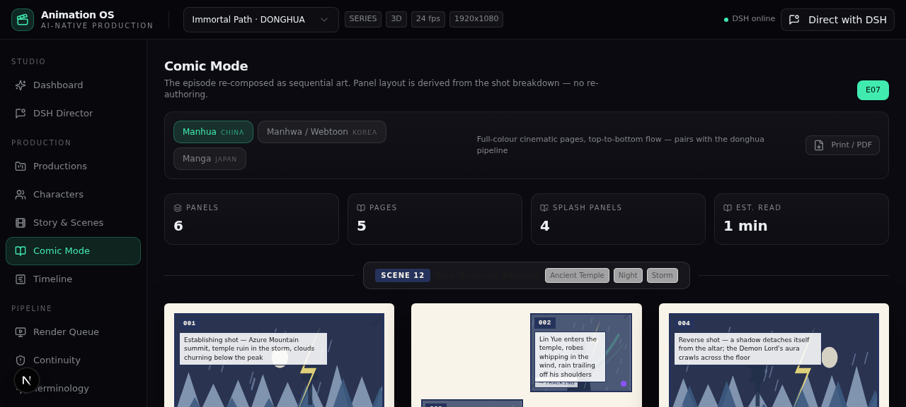
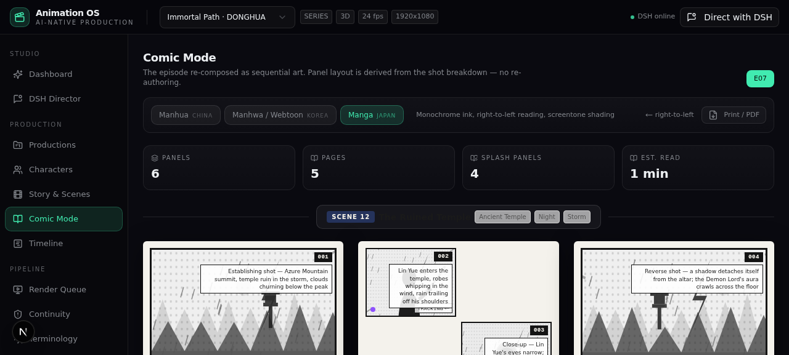
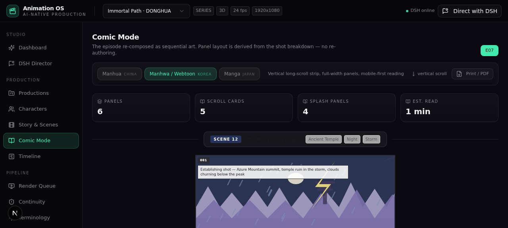
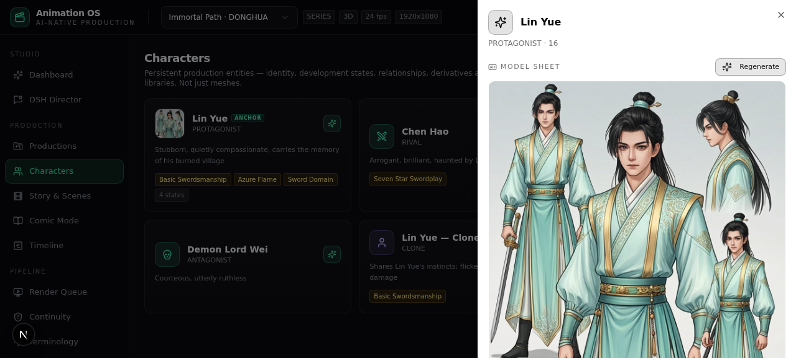
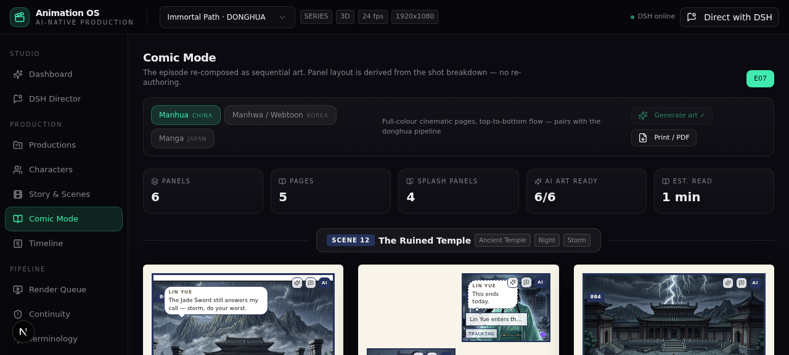
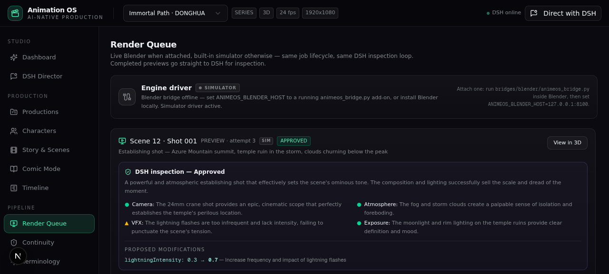
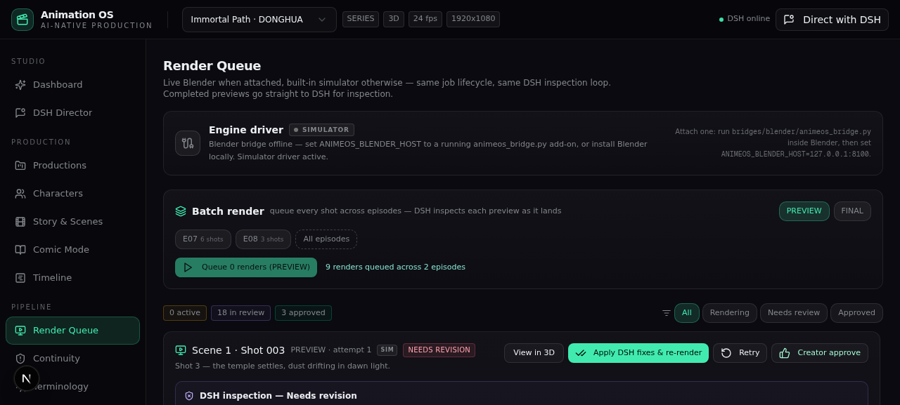
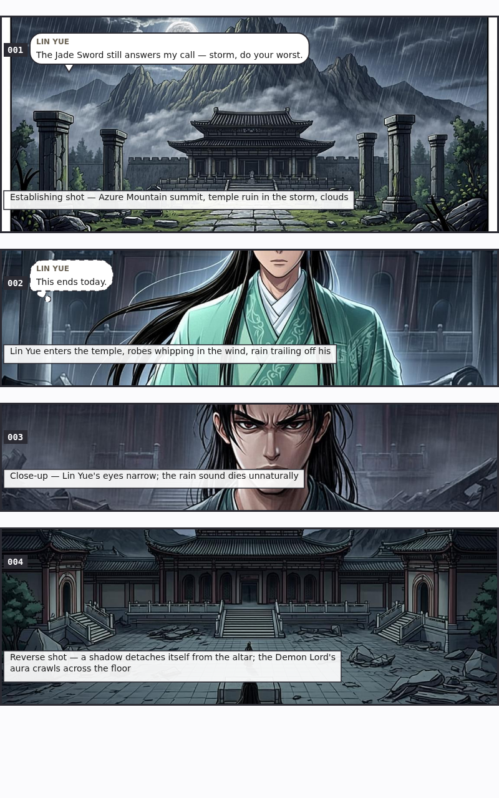

# AnimeOS - AI-Native Animation Production Platform

> **DSH decides · Tools execute · Engine builds · State remembers**

AnimeOS is an AI-native production studio for animated and illustrated storytelling. It natively supports **donghua**, **anime**, **manhua/manhwa (comics)** and adjacent formats through one unified, stateful production pipeline - designed so an AI director (DSH) drives the studio through tools, not ad-hoc chat.

## Core thesis

```
DSH decides → tools execute → engine builds → render → DSH evaluates → revise → approve
```

Every step writes to a persistent production universe: projects, seasons, episodes, scenes, shots, characters (with episode-resolved states), relationships, assets, terminology and continuity events. Nothing lives only in a chat log.

## Feature map

| Area | What it does |
|------|--------------|
| **DSH Director** | 88-tool production API behind a 4-round INTENT → PLAN → EXECUTE → OBSERVE orchestrator. Mid-turn project switching, full execution trace rendered in the console. The director authors **dialogue** (`set_shot_dialogue`), **panel art** (`generate_panel_art`), **character model sheets** (`generate_model_sheet`), the **art style direction** (`set_art_style`), **scene staffing** (`auto_assign_scene_team` - specialism-aware artist routing + content-matched LoRA attachment, load-balanced), **voice direction** (`direct_voice_takes` - state-aware delivery for every VOICE cue) and **voice casting** (`cast_voice_actor` - roster artists speak for characters) itself, pins **state arcs** across a shot range or across whole scenes of an episode (`set_state_arc`, `scope:'episode'`), paints **reusable arc templates** over a range in one call (`apply_arc_template` - the built-ins plus the production's saved shapes AND the studio library), **suggests a template** when the creator describes a beat in prose (`suggest_arc_template` ranks the registry against their words and hands back the apply framing), steers **per-state pose presets** (`set_state_poses` - a development state's body language, auto-resolved from the label on `create_character_state`), and proposes the webtoon export pre-flight in the same turn a diff detects staleness. **Ensemble beats**: pass `characters:[{name, stateLabel?}]` and one template lands on several speakers in ONE batch (per-speaker state overrides, unresolvable speakers skipped and reported, one combined Direction impact). The arc tools report the **direction impact** they just caused (which takes went stale) so DSH offers the re-render in the same turn, attach **playable arc chips** to the trace (the reply itself streams the arc's stored takes in story order), render **same-turn auditions** (one proposed read per engaged speaker of the exact stamped line, A/B against the stored take) and record **per-scope usage counts** so the registry shows which shapes each show actually applies. **Cadence scheduler**: `create_schedule` arms recurring studio work (a PLAN_RUN walks an approved plan a few steps per fire, the nightly-breakdown pattern; a REPAINT_QUEUE watch ticks render jobs and starts a supervised re-paint pass when the universe queue is dirty) fired by an in-process minute loop between conversations, every fire landing as a production event the creator audits from the scheduler panel (`steer_schedule` runs/enables/disables/deletes). **Art-aware continuity**: `check_art_continuity` scans for panel art that predates the state or anchor it should carry and can run a vision comparison of a hero panel against the character's canonical model sheet, filing ART_DRIFT / ART_VERIFIED events automatically. **Universe-facts vision checks**: `add_universe_fact` registers the world's canon rules (glowing blade spirits, two moons over the arena, the mask that never comes off) and `check_universe_facts` runs a vision model over a hero panel against every active fact - a holds/confidence verdict per fact lands as FACT_HELD / FACT_BROKEN events, and confident violations rank into the re-render queue in the Continuity view for a one-click panel re-render and re-check. **Per-episode plan templates**: `land_episode_plan` instantiates a shaped plan (beat-breakdown, panel-pass, render-pass, canon-audit) for one episode with its real scene/shot numbers resolved at landing time, PROPOSED for the creator's review gate - and any **creator-authored variation** saved in the plans panel (cloned from a built-in, reshaped row by row, `{episode}`/`{latestScene}`/`{title}` tokens resolving at landing, tools validated against the registry on save, PROJECT or STUDIO scope, usage-counted) lands by name or id the same way. **Identity scoring**: `score_panel_identity` vision-scores a panel (or, source:'render', a frame of the shot's FINISHED CLIP) against EVERY featured character's model sheet (0..1 per character plus per-aspect scores), targeted, worst-first batch, or defaulting to the worst artifact; the bar is the SOURCE's bar - storyboard panels repaint below 60%, but the SHIPPING PIXELS answer at 70% (THE BAR IS MEASURED: `measure_identity_bar` walks the finished renders, vision-scores each against the same sheets, and reads the honest distribution - cleared / average / worst / the repaint queue), `cast_identity_pass` reads the standing BY NAME (THE CAST ANSWERS THE BAR: every member's real per-character readings roll into one standing - CLEARING, BELOW with the worst shot ref named (the re-render queue by name), UNTESTED (anchored, never measured), UNANCHORED (no sheet - nothing to answer to yet)), a worst below the source's bar earns the re-paint (panel) or re-render (shipping pixels) offer in the result itself, and `reanchor_character` RE-ANCHORS a character whose drift curve declines because the design itself moved - the canonical sheet regenerates from the current design text, an IDENTITY_REANCHOR event restarts the curve's baseline, and recent panels re-score against the new sheet. **The studio writes to the creator**: a DAILY_DIGEST schedule posts a digest of the last 24 hours (renders, plan steps, schedule fires, canon and identity-drift headlines, queue pressure) as a production event the digest panel shows, and `post_digest` lands one on demand; `create_schedule` accepts `webhookUrl` / `digestEmail` so the digest DELIVERS itself beyond the studio (webhook POST, SMTP email via `ANIMEOS_SMTP_URL`), with every delivery outcome recorded on the digest and targets steerable any time; and since iteration 71 the push is PER-MEMBER (the My outbound panel subscribes each member's own webhook/email channels; digest posts and release slates fan out to the subscribed crew + OWNERs; every attempt lands on the NotificationDelivery ledger - SENT, REFUSED or FAILED with the detail). **And it ships**: `publish_cut` stages a platform publish package on the delivery spine (YOUTUBE, BILIBILI, DOUYIN, TIKTOK, STUDIO_INGEST) - the episode's latest cut is probed and conformance-checked against the preset (a 16:9 cut honestly FAILS a 9:16 platform), the package carries clamped metadata, a provenance credits line and an SRT built from the episode's dialogue, and the integration status is honest (credentials present, or a manual hand-off) - no network upload ever happens silently; `upload_package` then runs the platform's REAL upload adapter when the creator's credentials are set (YOUTUBE's resumable init+PUT, TIKTOK/DOUYIN's init-then-put, BILIBILI's multipart submit), with every outcome - OK or the honest FAILED naming the missing env key - appended to the package's PUBLISH event. **Voice cloning**: `train_voice_clone` trains a character's own voice from their rendered takes through the configured cloning provider (`ANIMEOS_VOICE_CLONE_URL`) and persists the trained voice id on the character - their lines then perform with THEIR voice wherever the provider can render it (state voice variants still deliberately override; the catalog voice stays the honest fallback). **Localization with memory**: `translate_subtitles` translates an episode's dialogue (or a pasted SRT) into any language with the Terminology memory ENFORCED - canonical renderings ride every batch prompt and a deterministic post-pass re-writes any cue the model drifted from, unknown-but-consistent renderings come back as suggestions to adopt (`create_terminology` grows the memory), and the translated SRT lands in `public/subtitles/` as a TRANSLATION event. **Native Blender designer**: `blender_asset_build` designs a character or environment as a versioned .blend LIBRARY ASSET from the production's design text, `blender_asset_inspect` vision-scores the asset preview against the canonical sheet, `blender_exec` runs raw bpy refinement passes in the studio's own runtime, `blender_viewport_shot` refreshes previews, `blender_asset_library` reads what exists - READY assets ride every matching render payload (design once, render many), and the whole DESIGN FACILITY stands behind it - named design laws (materials, lighting, motion, variation, sculpt, fx, physics), a self-correcting design loop (design_audit -> design_fix -> re-audit), learned craft memory (learned retopo flows, vision-guided sculpt plans, and LEARNED MOTION FLOWS - `learn_motion_flow` adopts a shot's VERIFIED keyed performance as the production's named memory of how a pose transition is performed for a dramatic register, and `set_shot_choreography` re-performs the verified timing on any shot, every application and every passing review growing the flow's applied/verified record), sequence programs that cut whole episodes with named grammars (per-slot fx and physics bindings, a per-slot WIND call the robes ride, a per-slot CLOTH call and FLESH call that scale the cloth and soft-body solvers' answers for the whole shot, and a per-slot MOTION call that CHAINS A PERFORMANCE - a choreography preset, a built-in, or a LEARNED MOTION FLOW whose verified timing re-performs on every shot the slot stamps, so the whole sentence re-performs end to end: lens, air, solvers, world AND body) plus LEARNED SEQUENCE FLOWS the studio directs from per dramatic register (`learn_sequence_flow` adoption, `direct_sequence register:'<register>'` consult - the consult itself names the verified programs no flow carries yet, and the chain rides the consult too) and `stage_battle` points the chain at EPISODE-SCALE battles (THE BATTLE IS STAGED: an arc of register legs - BATTLE > PURSUIT > RESOLVE - each leg consults the register's best-proven flow, the episode's shots are allocated across the legs by each sentence's own weight, EVERY leg pre-flights before a single shot is stamped, and the chained performances ride the slots) and the **Manifest** call-sheet panel, and pixel-level render judgement (review_render -> render_fix -> render_redirection). |
| **Render pipeline** | **Real animated shots, not stills**: every render job finishes as a sequenced h264 clip driven by the shot's camera grammar (movement, shot type, lens, lighting) and the scene's live parameters (fog veil, deterministic lightning flashes, energy pulses, rim contrast) - plus **character motion inside the frame**: shots carry start/end POSES (STANCE, WALK, LUNGE, SLASH, CAST, DRAW, BLOCK, LEAP, CROUCH, FALL, RISE, BOW, POINT) that the engines interpolate across the clip, so the character performs the beat, not just the lens. Blender is a NATIVE capability now: the studio provisions its own binary when missing, runs a resident headless bridge server it health-checks and restarts, and designs a versioned ASSET LIBRARY (.blend characters and environments with previews and honest identity scores) that render jobs load instead of rebuilding procedural stand-ins. Two engines produce those clips behind one job lifecycle: a **headless Blender worker pool** (a locally installed `blender` binary is auto-detected; each job spawns a fresh Cycles-CPU worker and `ANIMEOS_RENDER_WORKERS` slots render CONCURRENTLY - when the pool is full a PREVIEW overflows to MOTION while a FINAL parks in a priority wait queue with an honest 3D-WAIT stage) and the **built-in MOTION engine** (ffmpeg camera program over the shot's AI key art, or a procedural gradient plate when no art exists yet; overflow renders fall here while the 3D pool is busy). A workstation Blender can still attach over HTTP (`ANIMEOS_BLENDER_HOST`); without any engine a wall-clock simulator keeps the lifecycle intact. An **opt-in img2vid PREVIZ slot** (demoted to default-off: the output is designed, not AI-generated) lets pose-carrying hero shots preview their beat as an interpolation animatic when explicitly enabled (`ANIMEOS_IMG2VID=on`) or a host is attached (`ANIMEOS_IMG2VID_HOST`) - a previz pass and a motion benchmark, never the final render path; its job cards read PREVIZ. **Per-state pose presets** give the vocabulary muscle memory: every development state carries a start/end pair (`create_character_state` auto-lands the library preset matching the label - a furious state performs STANCE → LUNGE, a grieving one folds STANCE → CROUCH - and `set_state_poses` steers it), landed on any shot in one click (panel inspector's *Use state poses*, or the shots API `applyStatePoses`). The mouth program carries a **neural viseme pass**: an LLM plans the phoneme-level shapes (the mouth identity no envelope can recover) and conforms them onto the audio envelope (which keeps ownership of openness and timing), so consonants land where the words put them - and an **acoustic-model slot** (deterministic local DSP, `ANIMEOS_ACOUSTIC=off` disables) re-times the plan from the REAL WAV: the take is segmented into speech runs, silences and syllable anchors, spoken units redistribute over the real speech time (a unit interrupted by a pause continues after it), boundaries snap to the acoustic valleys between syllables, and coverage stops where the voice stopped instead of where the script ended - and a **neural rung** (`ANIMEOS_ACOUSTIC=neural`) adds an ASR pass that HEARS the take and collapses the units of words the voice skipped, so the mouth never performs unspoken words (the transcript is word evidence; the DSP warp still owns the timing). Clips play inline in the queue (every finished job card carries a video player), DSH's `render_shot` result names the engine and the camera move, and **Episode cut export** concatenates every shot's clip in story order, grades the episode's sound SERVER-SIDE - the cues land on KIND BUSES (VOICE / SFX / BGM / AMBIENCE) under a fixed gain law, the BGM ducks under the voice through a real sidechain compressor, the master is measured to the -16 LUFS target (EBU R128, the before/after numbers and the applied gain land in the manifest) and every bus stem persists beside the cut as its own WAV - and muxes video + audio into one distributable mp4 with a JSON manifest - and the **publishing panel** stages that cut for a platform with conformance checks, metadata and subtitle sidecars (packages land as PUBLISH events, upload stays a credential-gated or manual hand-off). Same LLM render evaluator with *bounded* parameter fixes, apply-fixes → auto re-render, approve → FINAL, batch rendering with throttled DSH inspections. **The world answers the beats**: a shot's directed grammar drives the worker's FX pass (TRAIL/BURST/AURA/MOTES emissive rigs bound to grammar beats), the physics pass (KNOCK/DEBRIS/SWAY rigid bodies that ground, roll under friction and settle to rest) and the REACTION pass (the figure staggers, dips and buckles away from the impact while the cloth whips with it) - and the finished clip is JUDGED: a pixel review measures the frame locally and reads it against the shot's directed intent, the fix loop applies the parameter fix each issue kind calls for and re-judges on the fresh pixels, and a graduated re-direction proposes grammar/fx ops when parameters are exhausted - all judged by the same fresh review. |
| **Blender design facility** | The studio designs like a 3D facility: a four-kind ASSET LIBRARY (CHARACTER / ENVIRONMENT / PROP / CREATURE - spirit swords, artifacts, vessels, quadruped/serpent/bird beasts) built from the production's design text into versioned .blends with lit previews and animated loops; NAMED DESIGN LAWS reused by name and usage-counted (design_material Principled BSDF recipes, design_lighting rigs, design_motion performances, design_variation Geometry Nodes scatters and arrays, design_sculpt seeded value-noise carves, design_fx spectacle programs, design_physics body laws); the SELF-CORRECTING DESIGN LOOP (design_audit's deterministic local audit + vision critique lands per-criterion scores and a concrete issue registry; design_fix runs a real bpy refinement pass, saves a new version and re-audits - an issue closes only when the re-audit agrees); LEARNED CRAFT MEMORY (learn_retopo_flow remembers verified topology runs - adoption, consult, reinforcement; plan_sculpt's surface probe + vision read plans the carve before it happens and the named SculptPlan grows its measured record; learn_sequence_flow adopts a verified sequence program as a dramatic register's named flow - direct_sequence consults the best-proven one, every application that lands whole with a clean read earns a clear, and the consult itself names the proven-but-unadopted programs so the memory grows on proposal); SCULPT AND BUDGET (per-kind triangle budgets, blender_retopo collapse-decimate with verified drift); and GLB/FBX ROUND-TRIP (blender_export re-imports every export and verifies it PER-CHECK: mesh, material and bone NAMES, the action's frame range, UV sets, bounded bbox/tri drift - an unverified export is a hope, not a deliverable). |
| **Style direction** | Per-production **art style tuning**: a custom style directive (overrides the visual-style preset), palette tokens and extra negative tokens - compiled into every panel-art and model-sheet prompt, tunable from the studio UI or by DSH itself. |
| **Casting consistency** | Per-character **AI model sheets** (turnaround reference images) plus a stored **canonical visual anchor** - the exact prompt tokens re-injected into every panel featuring that character, keeping faces/wardrobe coherent across panels and episodes. |
| **Continuity engine** | Universe-level conflict detection (e.g. destroyed artefact reappearing in Ep 29) with proposed resolutions, missing-capability analysis per scene, and **art-aware continuity**: a deterministic scan flags panel art that predates the episode-active state it should carry or the current model-sheet anchor (stale art), plus featured characters without an anchor; a **VLM deep check** sends a hero panel against the character's canonical model sheet and lands ART_DRIFT / ART_VERIFIED continuity events; **universe-facts vision checks** judge panels against the production's canon rules with a per-fact confidence (FACT_HELD / FACT_BROKEN events) feeding a worst-first re-render queue; and **identity-similarity scoring** puts a number on each panel's resemblance to its cast's model sheets (IDENTITY_VERIFIED / IDENTITY_DRIFT events, a below-bar re-paint queue on the Continuity view) - all surfaced in the Continuity view and to DSH via `check_art_continuity` / `check_universe_facts` / `score_panel_identity`. |
| **Comic Mode** | Shot breakdowns re-composed as sequential art - **manhua** pages, **manhwa/webtoon** vertical scroll, **manga** right-to-left pages. Deterministic panel-layout engine, **AI-generated panel artwork** (style-aware prompts seeded with shot type, environment, weather and character states), **speech-bubble authoring** (speech / thought / SFX, RTL-aware placement), print/PDF export, and **webtoon slice export** - the strip re-rendered at 800px and packed boundary-aware into platform-ready PNG slices, each scored slice carrying an **audio stem** (16-bit WAV, cues re-timed onto the slice timeline) that mixes **real TTS voice renders** for dialogue cues (**per-artist voice casting**: a character's cast roster artist performs the line; uncast speakers fall back to deterministic casting; **per-character-state delivery**: AUTO resolves the speaker's episode state, e.g. a battle-damaged Lin Yue reads strained and slow while an excited read rushes at 1.18x; a **line-level delivery** authored per dialogue line outranks scene direction, so one shot can play neutral then injured mid-performance; and a pinned standing direction overrides the state; a **state arc** (dialogue-editor arrow buttons or DSH `set_state_arc`) stamps one state onto the speaker's every following line across the scene, or across scene boundaries through the end of the episode (`scope:'episode'`), so a whole beat performs possessed without line-by-line edits, and each shot card carries violet **arc-span chips** (with the full span shown in the panel inspector's State arcs section: range, cross-scene badge, position and the covered lines); **state speed/pitch hints** bend pace and voice depth on top, so a possessed read can be slower and deeper without anyone re-pinning a register) with the synthesized SFX/BGM/ambience beds, plus a manifest with artists, LoRA metadata, voice takes (cast artist, delivery, direction + resolved state per take) and audio timing. The manifest also tags every voice stem and take with its **direction currency** (fresh / stale / unrendered against the current direction, per stem and per take, so downstream tooling knows which speech needs a re-render), and an **export pre-flight** names each stale or blocked take before the ZIP downloads, with an explicit export-anyway override. A **direction diff** board re-resolves what every VOICE cue in an episode would render as today, diffs it against the snapshot each take was made with, and re-renders only the affected takes. **Arc storytelling at season scale**: a **season-wide arc ruler** draws every state arc as a violet bar over an episode axis with **one lane per speaker** (a labeled gutter row per character, spans that survive an episode boundary merged into ONE season arc, click a bar to open that episode, clickable episode labels focus the ruler per episode), and **arc templates** (built-ins "possession spread", "full takeover", "recovery arc" plus **user-defined shapes saved per production or in the studio library**, with shape **versioning** that archives every replaced shape) paint a reusable beat shape onto one speaker's lines - or onto SEVERAL speakers as one parallel beat - from a dialog with a live dry-run preview, a **version diff** and a **cross-scope diff** (any two shapes across built-in / production / studio side by side with a human "what moved" list, plus **per-scope usage counts** on every saved shape). The same shapes are paintable and suggestable inside DSH via `apply_arc_template` / `suggest_arc_template`. **Everything with stored takes plays**: arc cards and ensemble clusters in the panel inspector (a cluster shows the merged story-order queue and streams the whole beat), ▶ chips on the ruler bars, and playable arc chips inside the DSH reply itself - all fed by one per-episode playback feed. |
| **Multi-artist studio** | **Style LoRA registry** (per-adapter trigger tokens, strength, base model) with **per-shot fine-tuning** from the panel inspector and **simulated LoRA training runs** distilled from approved panels (live steps, decayed loss curve, milestone log, TRAINED badge) plus a **Train all** batch button that fine-tunes every idle adapter in one pass; an **artist roster** with per-shot assignment, bulk assignment, a **workload-balance view** (production-wide spread badge, per-artist bars, **affinity-first pool distribution**: LoRA-bound panels route to the artist with the highest style affinity for that adapter, unbound panels rotate by load, **per-artist style affinity** scoring which LoRA each artist delivered with) and **per-artist voice casting** (each artist carries a TTS voice; characters bound to an artist via the casting board or DSH's `cast_voice_actor` are performed by that artist's voice everywhere), plus **per-state voice variants**: a development state can bind a different TTS voice (DSH `set_state_voice_variant` or the character sheet picker), so a possessed / transformed / battle-damaged Lin Yue is performed by a different voice entirely while that state is episode-effective; each state can also carry **speed/pitch hints** (character sheet selects or DSH `set_state_voice_variant` args) that bend the take's pace and pitch while the state is effective and flag older takes stale. The casting board **auditions** any roster voice on a throwaway TTS render - a custom line, or the character's own first dialogue line - in a chosen register before anything is cast, **auditions a whole state** (its variant voice plus its speed/pitch hints, before binding anything), runs **ensemble try rows** (one batch call renders every picked speaker as an A/B row with a per-row compare and a cast-order sequence play), and keeps a **per-state audition history**: every proposed read (DSH variant binds, ensemble applies, board state tries) lands in a timestamped, replayable, removable list with its performance snapshot (voice, register, speed/pitch, duration, the line, the date) pruned to the latest 12, and **any two recorded reads chain back to back** - pick sides A and B, hit compare, swap the order, hear them one after the other. DSH can staff whole scenes autonomously via `auto_assign_scene_team`. |
| **3D cinematic preview** | Three.js blocking preview built from the production's DESIGN DNA - the same compiled character and environment structures the Blender worker renders from: the cast figure carries the character's hair, robes, accent and weapon energy, the set is the scene's environment (terrace / peak / forest / gorge / temple terrain, moons, pagoda, bell, banners, bamboo, cloud sea, weather particles, time-of-day sky), plus live scene parameters and shot camera presets (movement-aware) with auto shot advance. |
| **Studio UI** | Dashboard, Productions, Characters (states / relationships / derivatives), Story & Scenes, Comic Mode, Timeline, Manifest (the director's call sheet: sequence programs, learned flows, and every shot's beats, poses, world bindings and render state), Render Queue, Reviews, Continuity, Terminology, Subtitles, History. |
| **Multi-user studio** | Shared-workspace auth with **role-gated writes**: register (first account becomes OWNER automatically), sign in at `/signin`, and every member sees the same productions while the role gates WRITES - VIEWER is read-only (the route gate refuses every mutating API call with an honest 403), EDITOR directs DSH and edits productions, OWNER manages the roster (the header user menu's Studio roster panel: members, liveness readouts, role selects) with the last OWNER protected. Two enforcement layers: the Next 16 proxy gates pages behind a session and mutating APIs behind a role above VIEWER, and sensitive routes re-read the user row fresh from the DB so role changes land immediately. **And the workplace landed**: comment threads anchor to episodes, scenes, shots (a comic panel IS its shot), voice takes and canon facts - the anchor row resolves the project server-side, EVERY signed-in member may speak (VIEWERs ride a one-path proxy allowlist: speaking is not directing), the thread's author or EDITOR+ resolves, and each comment lands a COMMENT event. The **human approval gate** (OWNER policy toggle on the Render Queue) turns DSH's APPROVED inspection into a recommendation: the render parks at awaiting-creator until an EDITOR+ approve releases it to FINAL, or a reject sends it back with a required note that lands in the shot's thread as a first-class comment; the **Reviews** view gathers what waits on people (gate-held renders with one-click approve/reject, open crew threads), and the DSH context's workplace line carries the gate state and the open threads so the director reads the room before it directs. **Per-production memory boundaries**: DSH directs one production at a time - its conversation, canon and events stay bounded to it; a mid-turn create_project keeps the conversation on the home production, opens the newborn's history with an origin event and seats its maker on the newborn crew. **Invite links**: the OWNER's keyring cuts single-use codes that register a newcomer with a carried role (EDITOR/VIEWER) and an optional crew seat with craft lens - spent keys, revoked keys and expired keys all open nothing. |

## Screenshots

**Comic Mode** - the same episode re-composed as manhua (LTR, colour), manga (RTL, monochrome + screentone) and manhwa/webtoon (vertical scroll) pages:

| Manhua | Manga (RTL) | Webtoon |
|--------|-------------|---------|
|  |  |  |

**Casting consistency & the live bridge** - Lin Yue's AI model sheet (turnaround anchor), DSH-authored dialogue rendered as bubbles over anchor-consistent AI art, and the engine-driver card:

| Model sheet | DSH-authored art + thought bubble | Engine driver |
|--------|-------------|---------|
|  |  |  |

**Batch pipeline & slice export** - the cross-episode batch render card in the queue, and platform-ready 800px webtoon slices cut from the strip (bubbles, captions, chips re-drawn at export resolution):

| Batch render | Webtoon slice (800px) |
|--------|-------------|
|  |  |

## Native format support

| Format | Pipeline posture |
|--------|------------------|
| **Donghua** | Style preset with zh-CN terminology defaults, cultivation-state character modelling, ink-wash flavoured panel art, xianxia demo universe. |
| **Anime** | Cel-shading posture, anime timing stage in the render ladder, ja-JP terminology defaults. |
| **Manhwa** | Manhwa-inspired framing preset (ko-KR) + webtoon vertical-scroll Comic Mode. |
| **Manhua / Manga** | First-class Comic Mode layouts with correct reading direction (LTR / RTL / vertical). |

## Architecture

```
src/
├── app/
│   ├── api/            # 15 route handlers (projects, characters, scenes, shots,
│   │                   #   render-jobs, dsh, panel-art, character-sheet, bridge, …)
│   └── page.tsx        # single-route studio SPA
├── components/
│   ├── views/          # studio views (dashboard, dsh-console, comic, …)
│   ├── preview/        # three.js cinematic preview
│   └── studio/         # app shell (zustand + TanStack Query)
└── lib/
    ├── dsh/            # tools, prompts, orchestrator, evaluator
    ├── ai/             # art service: panel art + character model sheets
    ├── bridge/         # MOTION engine (ffmpeg camera grammar) + Blender bridge
    ├── blender/        # NATIVE runtime (provisioning + resident server + exec) + asset library
    ├── engine/         # render pipeline (Blender ⇄ MOTION ⇄ simulator drivers)
    ├── comic/          # panel layout, dialogue model, stems, episode cut builder
    ├── continuity.ts   # conflict + capability checking
    └── seed.ts         # "Immortal Path" demo universe
bridges/blender/       # animeos_bridge.py - worker-mode renderer + attachable server
```

**Stack:** Next.js 16 · TypeScript · Prisma/SQLite · TanStack Query · zustand · Tailwind · shadcn/ui · Three.js.

Per the replaceability principle, the render engine is a **pluggable driver** chain: headless Blender workers when a `blender` binary exists, the built-in MOTION engine (ffmpeg) otherwise, a wall-clock simulator as the last resort - the production state machine, queue and DSH evaluation loop are identical.

### Render engines

- **Headless Blender (auto-detected).** If a `blender` binary is on the machine (or `ANIMEOS_BLENDER_BIN` points at one), each render job spawns a fresh worker: `blender -b -P bridges/blender/animeos_bridge.py -- --worker --job <file>`. Since v4.0 the worker renders the DESIGNED pass: AnimeOS compiles the production's design text (model-sheet anchors, appearance notes, wardrobe/weapon states, environment briefs) into design DNA (`src/lib/animation/design.ts`) and sends it with every job, so the worker builds the DESIGNED character (stylized smooth figure, layered robes with sleeves, cuffs, sash and skirt panels, hairstyle per DNA - topknot / ponytail / braid / long / short, per-DNA weapon - sword / staff / spear - with the character's energy color, high collar, glowing stylized eyes) on a DESIGNED set (terrain per environment - terrace / peak / forest / gorge / temple - plus features: two moons, pagoda silhouette, bronze bell, wind banners, pillar stubs, bamboo, sea of clouds, lanterns, waterfall and stream, with a time-of-day sky and key light; a second detected character blocks across the set). A prop-scale camera table frames the 0.9m figure properly (chest/face-height targets, 1.9x distances). Without DNA the worker falls back to the v3.3 stand-in figure and set. It builds the set and drives a camera rig through the shot's movement grammar frame by frame, applies the AnimeOS scene parameters, renders with Cycles CPU and encodes h264 (system ffmpeg, or Blender's own FFMPEG writer). Shots carrying a pose program get an **articulated stand-in figure** whose joints interpolate between the start/end poses with eased timing - lunges, casts, walk cycles with stride swing and root bob - and the rig follows the subject's travel so the body stays framed. And since iteration 74 the body can PERFORM instead of slide: a keyed choreography program (design_choreography / set_shot_choreography - built-ins The Combo, The Draw Storm, The Rising Fang) replaces the two-pose interpolation with keys - anticipation earns the strike, the strike explodes, the hold sells the read, the follow-through settles - while a REAL impact light flares and the camera takes a decaying punch on the strike frame and the striking limb smears up to 1.35x on the fastest frames (the keys own the body; the lens, the cloth, the flesh and the physics still answer it). The v3.2 rig adds a **face and hands**: emissive eyes that squint and blink on a deterministic schedule, brows that knit angry or lift surprised, a mouth that opens with effort, and on each arm a palm, four fingers and a thumb that curl into grips, spread to channel energy or extend an index to point - every pose carries a 7-channel face/hand row eased between the endpoints exactly like the joints, and tight shot types aim the camera at the head so closeups frame the performance. The v3.3 rig makes the face **speak**: a shot with SPEECH dialogue and a tight framing arrives with a millisecond viseme program and the mouth performs the lines frame by frame - vowels open, m/b/p press shut, "ee" spreads, "oo" purses, and the pose's effort mouth stays as the floor. The program is **audio-driven over the real TTS take**: the take's WAV is analyzed frame by frame (RMS energy opens the mouth, zero-crossing rate separates voiced vowels from wide fricative hisses, silence closes), so the lips match the audio the viewer hears; the v3.4 program adds the **neural viseme pass**: an LLM plans the dialogue's phoneme-level mouth shapes (a 15-entry vocabulary - round oo, wide ee, lips-shut stops - weights clamped, cached per line set) and the plan's identity is CONFORMED onto the audio envelope, which keeps ownership of openness and timing, so consonants land where the words put them; without a take the plan performs the line itself, and a refused model degrades to the audio-only then text pass without blocking the render. Since iteration 75 the workers form a POOL (`ANIMEOS_RENDER_WORKERS`, default 2, clamped 1..4, read live): two Cycles workers render CONCURRENTLY, and when the pool is full a PREVIEW overflows to the MOTION engine while a FINAL PARKS in a priority wait queue (FINAL over PREVIEW, older first, an honest 3D-WAIT stage line) until a slot frees - the tick pumps the queue within one poll, and a waiter lost to a server restart fails honestly instead of hanging.
- **MOTION engine (built-in).** A deterministic camera program (per-movement zoom/pan/tilt profiles x shot-type framing x lens character x lighting grade x fog/lightning/energy) is animated over the shot's key art with ffmpeg zoompan - or over a procedural gradient plate when no art exists - and encoded at the project's fps. Pose pairs play here as a blocking approximation: the program notes them and lands an impact beat at the end pose. Speaking closeups get a blocking speech beat per spoken line (a soft shimmer over each line's window) so the cut still reads as "someone is talking here".
- **img2vid previz slot (opt-in, default off).** Demoted: the studio's output is designed, not generated, so the interpolation model is previz and benchmark only. When explicitly enabled (`ANIMEOS_IMG2VID=on|zai|previz`) or a host is attached, pose-carrying hero shots route to it: the shot's key art (inlined as a data URL) plus a pose/camera program go to the async video-generation API; on a speaking closeup the prompt also carries the lines as explicit speech direction; the finished animatic downloads back into `public/renders/` and plays in the same queue behind a PREVIZ chip. An attached host wins (`ANIMEOS_IMG2VID_HOST` speaking the tiny jobs protocol); unset flag and no host means the slot is invisible and the designed engines (Blender, MOTION) take every job. A provider lost mid-job degrades to the MOTION engine transparently (and rebuilds the speech program so the takeover keeps the lip-sync).
- **Native Blender runtime + asset library (v4.1).** The studio owns its Blender: `src/lib/blender/runtime.ts` detects the binary, auto-provisions the pinned release (Blender 5.2.2 LTS from download.blender.org since iteration 72 - the proven 4.3.2 stays as a fallback candidate) when a workspace reset wipes it, starts a RESIDENT headless bridge on :8101 that it health-probes and restarts with backoff (the per-job spawn path stays as fallback), and exposes an exec sandbox (`blender_exec`) where the DSH designer runs real bpy passes. The design-time library (`src/lib/blender/assets.ts` + `bridges/blender/asset_builder.py`): one design DNA in, one versioned .blend + a lit 512px Cycles preview out (`assets/blender/`, previews served from `/assets-blender/`), a `BlenderAsset` row per character/environment carrying version, build log, DNA audit and an honest vision identity score vs the canonical sheet. READY assets ride every render payload; the worker appends the .blend and resolves the SAME v3.x/v4.0 rig contract by base object name, so poses, lip-sync and camera math are untouched - a missing file falls back to the procedural DNA builders honestly, and the worker state reports `figureSource` / `setSource` so every job's asset decision is auditable.
- **Workstation attach.** Run the bridge server inside any Blender (GUI or headless) and point `ANIMEOS_BLENDER_HOST` at it: jobs go over HTTP and the finished clip returns as base64.

```bash
# inside any Blender ≥ 3.x (GUI or headless):
blender -b -P bridges/blender/animeos_bridge.py -- --port 8100
# then point the studio at it and restart the dev server:
ANIMEOS_BLENDER_HOST=127.0.0.1:8100 bun run dev
```

The add-on exposes `GET /status`, `GET /progress`, `POST /render`, `POST /ping` on `127.0.0.1`. Every engine maps the tunable scene parameters (fog, lightning, energy, rim light, camera distance) onto its own equivalents, honors the shot grammar (ESTABLISHING→24mm wide … EXTREME_CLOSEUP→100mm), streams per-frame progress into the same queue UI, and lands an mp4 in `public/renders/`. If an attached bridge drops mid-job the driver chain takes over transparently.

## Run it

```bash
bun install
cp .env.example .env      # DATABASE_URL=file:./db/custom.db
bun x prisma db push
bun run dev               # http://localhost:3000
```

The database auto-seeds on first request with the **Immortal Path** demo production: a donghua universe with character development states, a six-shot Scene 12 breakdown, a seeded continuity conflict (Jade Sword destroyed in Ep 29) and terminology entries.

### Try the loop

1. Open **Render Queue**, trigger a render on any shot - the **Engine driver** card shows whether headless Blender workers or the built-in MOTION engine is driving; the job badge shows `BLENDER`, `PREVIZ` (the opt-in previz slot) or `MOTION`. Watch progress stream per frame, then **play the finished clip right on the job card** - a dolly-in on a closeup dollies, a pan pans. Give the shot a **pose program** first (panel inspector > Motion poses, or DSH `set_shot_poses`) and the clip shows the character performing: the Blender stand-in lunges, casts or walks between the start and end poses. Or skip the authoring: hit the panel inspector's **Use state poses** and the featured character's episode-active state lands its preset (a furious state performs STANCE → LUNGE).
2. Same view, pick an episode in **Episode cut** and hit *Export cut (mp4)*: the episode's clips concatenate in story order, the stems synthesize server-side (real TTS takes included) and video + audio mux into one downloadable cut with its manifest. Then pick the episode in **Publishing** and hit *Stage package*: the cut is conformance-checked against the platform preset (try Douyin with a 16:9 cut for the honest FAIL), and the package carries the title/description/tags, the SRT subtitle sidecar and the upload checklist.
3. Watch the evaluation come back `NEEDS_REVISION` with bounded parameter fixes → **Apply fixes** auto-queues attempt 2.
4. Open **DSH Director** and talk to the studio: *"For scene 12 shot 3: author the dialogue, generate a model sheet for any new character, then paint the panel in manhua style"* - the 81-tool trace shows the director doing it itself. Ask it to *"shift to a cold moonlit silver-blue palette"* and it retunes the production's style direction itself. Ask it to *"land the beat breakdown for episode 1"* and a per-episode template lands as a proposal in the plans panel. Ask *"how is the studio doing?"* and `studio_pulse` answers with the canon score, identity standing, drift curves, schedule outcomes and queue pressure. Ask *"catch me up"* and `post_digest` lands a digest of the last 24 hours in the studio digest panel.
5. Open **Characters** - hit ✦ on a character to generate their **model sheet**; the stored anchor then steers every panel they appear in (cards show an `ANCHOR` badge once locked).
6. Open **Comic Mode** and flip the same episode between manhua / webtoon / manga layouts. Bubbles (speech / thought / SFX) place themselves around the art - mirrored for manga RTL - **Print / PDF** exports pages with chrome hidden, and in webtoon format **Export slices** downloads a ZIP of 800px platform-ready strips whose audio stems mix real TTS voice takes into the score.
7. In **Comic Mode**, open **Motion sound** on a motion panel: auto-score the timeline, hit **Render voices** to give every dialogue cue a real TTS take performed by the speaker's cast artist in the speaker's current character state (or pick a voice, speed and an explicit excited / injured delivery per cue, plus a directorial note), and preview - exported stems use the same takes. Author **line-level delivery** in the dialogue editor (the ✎ on any panel) to play one shot's lines in mixed registers; the motion-sound board shows which line direction outranks the standing one.
8. Open **Artists** to run **voice casting**: give each roster artist a TTS voice, then bind characters to the artist who speaks for them. **Audition** any voice first - the board renders a throwaway sample (your line, or the character's own first line, in a chosen register) without saving a take - or pick a development state under a character and hear exactly how that state performs (variant voice + speed/pitch hints). Every proposed read lands in the state's **audition history** (replayable, removable), and **any two recorded reads chain back to back**: pick sides A and B, hit *compare A · B*, and hear them one after the other. Select several characters for an **ensemble try** and DSH or the board renders an A/B row per speaker with a sequence play. Ask DSH to do the same with `cast_voice_actor`, and to set standing deliveries scene-wide with `direct_voice_takes`.
9. After a state beat or a line edit, open **Direction diff** in the Comic Mode toolbar: every take is compared against today's direction and **Re-render affected** touches only the stale ones (fresh takes are never re-rendered).
10. Open **LoRA** and hit **Train all** to batch-fine-tune every idle adapter from the approved panels (each run shows a live loss curve), or **Train** a single one; then open **Workload** and hit **Distribute pool (affinity-first)** to route unassigned panels to the artist whose style affinity is highest for each panel's adapter.
11. Back in **Render Queue**, use **Batch render**: tick two episodes, hit *Queue N renders*, and watch the queue fill, DSH inspect each preview (throttled per poll), and the stats row track active / review / approved. Finished cards carry the **per-provider readout** ("MOTION 12.4s (built-in ffmpeg)", ~credits when a hosted provider billed) and the **provider ledger** aggregates latency and cost per engine above the queue.
12. Open **Continuity** and scroll to **Identity similarity**: after panel art exists for sheeted characters, *Score worst 3* vision-scores the panels against every featured character's model sheet - rows show per-character percentages, anything below the 60% identity bar lands in the re-paint queue with a one-click *Re-paint + re-score*, and the *Affinity pass* button embeds every panel and sheet locally (block-robust region hashes + palette histograms, instant and provider-free) to keep a drift tripwire alive when the vision provider is down. When a character's drift curve DECLINES because the design itself moved, press **Re-anchor** on their curve row: the canonical sheet regenerates, an IDENTITY_REANCHOR event marks the baseline restart (the dashed violet marker on the sparkline), and their recent panels re-score against the new sheet. Just below, **Canon health** rolls the universe-facts verdict history into a score with per-fact status rows. In **DSH Director**, the plans panel's **Per-episode templates** section lands a shaped plan (beat breakdown, panel pass, render pass, canon audit) for the picked episode - approve it, run it by hand, or arm a nightly schedule and the studio breaks the episode down while you sleep - and asking DSH for a `studio_pulse` reads the whole studio's health (canon score, identity and affinity, 14-day schedule outcomes, queue pressure) in one instant line.
13. Sign in as a second member (register from `/signin` - they start VIEWER) and the studio becomes a WORKPLACE: every render card's **Discuss** button opens the shot's comment thread where any signed-in member can speak (VIEWERs included - speaking is not directing), the thread's author or EDITOR+ resolves, and the new **Reviews** view collects the crew's open threads. Arm the **Human gate** (OWNER toggle on the Render Queue): DSH's APPROVED inspection then PARKS the render at awaiting-creator with a HELD badge and an *awaiting approval* counter until a person approves it into FINAL or rejects it with a note that lands in the shot's thread - and the DSH context's workplace line carries the gate state and the open threads, so the director reads the room before it directs.

## Status

The full thesis runs end-to-end: DSH directs dialogue, panel art, model sheets, style direction, scene staffing, voice casting and state-aware voice direction through 80 production tools (including the NATIVE BLENDER DESIGNER: the studio's own auto-provisioned Blender runtime with a resident health-checked server, a design-time asset library of versioned .blend characters/environments built from the design text, previews, and honest vision identity scores - ready assets ride every render payload so the worker loads the DESIGNED asset instead of rebuilding procedural stand-ins, including the supervised auto re-paint runner, the universe-facts loop with reword-or-retire suggestions, cross-turn plans, per-episode plan templates plus creator-authored variations, the cadence scheduler with a daily digest, identity scoring with per-character drift curves, and the studio_pulse health readout); the acoustic-model slot's evidence is now PERSISTED per take (a one-click acoustic audit records the speech runs, syllable anchors and the neural rung's ASR word evidence on the cue row, badged on the sound timeline), reworded facts close their own loop (a reword records the old wording, and the drift sweep re-audits every pending fact in one pass, clearing the marker when the loop closes), publish packages now write their HAND-OFF FOLDERS to disk (package.json + SRT + checklist next to the cut) and a PUBLISH_RUN schedule stages an episode's package on a cadence, and identity vision-scoring now judges the SHIPPING PIXELS too: a frame pulled from each finished render clip is scored against the cast's model sheets alongside the storyboard panel, so the panel-versus-render identity gap is measured, not guessed; renders are real animated clips - a headless Blender worker pool or the built-in MOTION engine animates every shot's camera grammar into an h264 cut that plays straight on the queue card, speaking closeups lip-sync their lines on the stand-in's mouth rig with the program derived from the real TTS take's audio and CONFORMED to a neural phoneme plan (the LLM plans the phoneme-level mouth shapes - round oo, wide ee, lips-shut stops - the audio envelope keeps ownership of the timing, and iteration 67's FORCED ALIGNER places every phone to the millisecond (words land on the take's measured syllable anchors, each phoneme window measures its own openness from the audio, and the plan's closed stops cap the mouth in their exact windows - persisted per take on the acoustic audit's phoneme timeline; without a take the plan performs the line itself, and a refused model degrades to the audio-only then text pass), and episode exports mux those clips with server-synthesized stems into one distributable mp4; work that outlives a turn lands as a resumable plan the creator approves in the review panel and DSH executes step by step across conversations, recurring work runs on a cadence without anyone clicking - nightly plan fires land the breakdown steps, a render-queue watch starts re-paint passes when the universe queue is dirty, and every fire is auditable as a production event - the studio's engines report per-provider latency and estimated cost on every queue card with a ledger per engine, and the studio reports its own health and writes to the creator: a canon score over the fact verdict history with reword-or-retire suggestions for facts whose audits keep failing, per-character identity drift curves AND per-fact confidence drift curves over episode order, a 14-day schedule digest with overdue and error-streak flags, a provider-free embedding tripwire (block-robust region hashes + palette histograms per panel vs every sheet - a reframe moves the global hash but not the blocks) under the vision identity scores, and a daily digest (scheduled or on demand) that lands the last window of studio activity as one readable message and DELIVERS itself beyond the studio - POSTing to a webhook and mailing via SMTP when ANIMEOS_SMTP_URL is configured, every outcome recorded on the digest; Comic Mode produces AI-illustrated, dialogue-authored, casting-consistent pages in all three native formats, directs voices line by line inside a shot, auditions cast choices and whole character states before committing them, remembers every proposed read per state with a replayable A/B-chainable history, exports webtoon platform slices whose audio stems carry cast-artist, character-state-shaped TTS voice takes over the synthesized score, diffs every episode's direction and re-renders only the takes that moved, measures the whole season's state arcs on a cross-episode ruler with one lane per speaker, paints beats from reusable arc templates (saved per production or in the studio library, versioned, usage-counted, diffable across scopes), lands ensemble beats on several speakers in one batch with same-turn auditions and playable arc chips in the reply itself, batch-trains style adapters from approved panels, and routes the panel pool affinity-first while ranking per-artist style affinity, and the queue swallows whole episodes in one batch; and the studio is a WORKPLACE now - comment threads hang off episodes, scenes, shots, voice takes and facts with every signed-in member able to speak (VIEWERs included, through a one-path allowlist) and the author or EDITOR+ resolving, an OWNER-armed human approval gate turns DSH's APPROVED inspection into a recommendation that waits for a person (a reject's required note lands in the shot's thread), a Reviews view gathers what waits on humans, and the director's context carries the gate state and the open threads so it reads the room before it directs. The Blender frontiers turned the studio into a DESIGN FACILITY (iterations 51-61): the asset library grew to four kinds with designed material/lighting/motion/variation/sculpt recipes, the self-correcting design loop audits and fixes every design with persisted per-criterion evidence, per-beat secondary motion hangs every figure's cloth and hair on the directed grammar beats - and iteration 65 graduated the CLOTH to the real Blender solver: the wind calls, beat-boundary impulses and the body's stagger steer each part's anchor bone and the Armature-Subsurf-Cloth stack answers with real folds and lag no spring can fake (hair keeps the springs; the render state names which ran), and iteration 66 dressed the render from the sheet itself: the canonical sheet's measured palette is COLOR LAW over the DNA defaults (a bounded 35% pull on robe/accent/hair/boots, honest skips, the state's identity line), named FX programs ignite the beats (trail, burst, aura, motes), named physics programs answer them with real gravity, bounce and settle, REACTION staggers the body away from the violence, sequence programs cut whole scenes with named grammars (now whole episodes, with per-slot fx and physics bindings), the finished render is JUDGED by a pixel review that measures the frame and reads it against the shot's directed intent, the fix loop closes on the fresh pixels and graduates to cited grammar/fx re-direction when parameters run out, and the craft is LEARNED: verified retopo runs become named flows, and the surface probe + vision read plan every sculpt carve before it happens.

## Roadmap - what is not achieved yet, and how we will get there

The plan's destination is an AI-native studio that takes a story from prose to published, animated episodes with zero manual coordination. The thesis loop is closed, but these parts of the vision are still open:

1. **Performance-grade character motion.** Characters move inside the frame: shots carry start/end pose chips (13-pose vocabulary), every development state carries a **pose preset** (auto-resolved from the label, steerable per state, landable on shots in one click), the Blender worker articulates a stand-in between the poses with a **full face and hand rig** (blinking emissive eyes, tilting brows, an effort mouth, and fingers that grip the blade, spread to channel or extend to point, with blade follow-through), the **img2vid previz slot is DEMOTED to opt-in previz** (default-off: the output is designed, not AI-generated; `ANIMEOS_IMG2VID=on` or an attached host previews a pose beat as an animatic behind a PREVIZ chip, never as the deliverable), the MOTION engine plays an impact-beat approximation, and **speaking closeups lip-sync**: the mouth rig performs a viseme program **derived from the real TTS take's audio** (RMS energy opens the mouth, zero-crossing rate separates voiced vowels from wide fricatives, silence closes; the dialogue-text program remains the fallback when a take is missing), the img2vid prompt gets the lines as speech direction, and MOTION lands a blocking speech beat. The **neural viseme pass** landed: an LLM plans the dialogue's phoneme-level viseme score (a 15-entry mouth-shape vocabulary, weights clamped, cached per line set) and the audio path CONFORMS to it - openness stays audio-owned while wide/round identity and closed-stop placement come from the plan; without a take the plan performs the line itself (a strict upgrade over the per-character table), and a refused model degrades to the audio-only then text pass without blocking the render. And the **acoustic-model slot landed**: the take is segmented deterministically into speech runs, real silences and syllable anchors, the plan's units re-time over the real speech (a unit a pause interrupts continues after it, boundaries snap to acoustic valleys, coverage stops where the voice stopped), so the mouth shapes land where the VOICE put the words - `ANIMEOS_ACOUSTIC=off` keeps the plan's even spread. What is still missing: learned interpolation quality on par with the best closed video models (timestamped phoneme alignment landed in iteration 67: a deterministic forced aligner places every phone to the millisecond from the plan's shapes, the take's measured energy and the DSP's syllable anchors - words spend the anchors their vowels demand, and a bilabial stop the plan placed closes the mouth in its exact window)). And **solver-grade FLESH landed** (iterations 65 + 68 + 69): the robes are SOLVED (the real Blender cloth solver under the directed air, its per-shot CLOTH call scaling the answer) and the flesh layer itself is now SOFT BODIES - the trunk and face volumes run the real Blender soft-body solver (probed before it shipped: storm lag 141x the calm hold, bit-exact determinism, bounded, settling), driven by the same beat clock, with the per-shot FLESH call directable beside the cloth one. What remains open here is learned interpolation quality on par with the best closed video models.
2. **Continuity checking that sees the universe, not just the sheet.** The art layer joined the continuity engine: a deterministic scan flags stale art (panel predates the episode-active state or the current model-sheet anchor) and missing anchors, a **VLM deep check** compares a hero panel against the character's canonical model sheet (ART_DRIFT / ART_VERIFIED events), and **universe-facts vision checks** judge every panel against the production's canon rules with a confidence per fact - confident violations rank into a worst-first re-render queue. The loop now CLOSES ITSELF: every panel prompt carries the production's active canon (**fact-aware art prompts**), the **supervised auto re-paint runner** walks the queue worst-first without the clicks - each step re-paints with the flagged facts restated as corrections, re-checks with the vision model, records FIXED / STILL_BROKEN / ERROR, and still-broken panels stop retrying and wait for the director (pause / resume / abort between steps, run state persisted and streamed to the Continuity view) - panels carry an **identity score**: one vision call scores the panel against EVERY featured character's model sheet (0..1 per character plus face/hair/wardrobe/weapon/palette/style aspects), persists per shot, and a worst below the 60% identity bar queues the panel for a one-click re-paint + re-score (IDENTITY_VERIFIED / IDENTITY_DRIFT events, DSH `score_panel_identity` targeted, worst-first batch or default-to-worst) - and the whole history reads back as a HEALTH READOUT: the **canon health** panel rolls the fact verdict history into a 0..1 score (0.4 coverage + 0.6 hold rate over active facts, an unchecked canon is not a healthy canon) with per-fact status rows (HELD / VIOLATED / UNVERIFIED, worst-first) - and the panel now SUGGESTS ITS OWN FIX: a fact audited on 3+ panels whose hold rate fell under a third earns an **auto-retire suggestion** (worst first, the reason names the counts and the reword-or-retire fork), with Reword (PATCH the text in place) and Retire (deactivate) buttons in the canon-health panel and the suggestion riding `studio_pulse` and the DSH context. The curves went FACT-LEVEL: every verdict becomes a point on a per-fact confidence curve over episode order (same trend bands as the character curves, steepest decline first), DECLINING facts surface in the canon-health panel with inline sparklines, `studio_pulse` and the DSH context name them - a fact losing verdict confidence across the show is headed for a violation streak, and the reword-or-retire suggestion is the exit - and the **reworded-fact re-audit helper** closed the loop: rewording a fact (Reword button, or the canon-health API) automatically re-runs the vision check on every panel that audited the OLD wording, so those same panels answer whether the NEW wording holds, the fresh verdicts feed the health score and the drift curves, art-less targets are reported as honestly skipped, and everything lands as a CONTINUITY event - and the suggestions are CURVE-AWARE now: a fact whose confidence curve DECLINES steadily across episodes earns the reword-or-retire suggestion even while its hold rate is still perfect, so the writing fix lands one episode earlier. The reword loop went SELF-SERVE: a reword records the OLD wording on the fact (`lastRewordedFrom`), and the **reword drift sweep** (canon-health panel button, `reaudit-drifted` action) re-audits every pending fact in one capped pass - a fact closes when its panels were actually re-checked under the new wording, or vacuously when nothing ever audited the old wording (a marker that could never serve would never clear). Next: a reword-aware curve break marker.
3. **DSH across turns and days.** The director used to reason only inside one 4-round turn. Now work that will not fit lands as a **cross-turn plan**: create_plan writes an ordered tool-call list (each step with a why, capped at 12) that starts PROPOSED in the creator's **plan review panel** on the DSH view; approving opens the runner and run_plan executes the next 1-3 steps per call through the real tool path (a failed step parks the plan AT that step for a retry), with pause/resume/abort steering and every result recorded on the plan plus production events - and the plan's progress rides the production context, so a LATER conversation picks it up exactly where it stopped. The studio now also RUNS ON A CADENCE: `create_schedule` arms recurring work (a PLAN_RUN walks an approved plan maxSteps per fire, so nightly breakdowns execute themselves once the plan is approved; a REPAINT_QUEUE watch ticks active render jobs and starts a supervised re-paint pass when the universe-facts queue is dirty and no run is live), an in-process minute loop fires due schedules between conversations, each fire claims its slot first (no double-runs) and lands a production event with its outcome (OK / SKIPPED with the reason / ERROR) on the row for the creator to audit, and DSH steers schedules with `create_schedule` / `steer_schedule`. The nightly-breakdown pattern now has a ONE-CLICK entry: the plans panel carries **per-episode plan templates** (beat-breakdown opens a fresh scene with a three-shot cinematography breakdown, panel-pass paints and scans a scene's first three panels, render-pass queues previews plus a direction diff, canon-audit vision-verdicts the hero panel against the facts); landing one resolves the episode's real scene/shot numbers into a PROPOSED plan the creator approves once and runs by hand or arms on a nightly schedule (UI, DSH `land_episode_plan`) - and the creator can now author VARIATIONS: the plans panel's author clones a built-in's resolved steps, reshapes every row (tool, args JSON, why), saves it to the production or the studio library with `{episode}`/`{latestScene}`/`{title}` tokens that resolve per episode at landing, and lands it by name or id exactly like a built-in (tools validated against the registry on save and again at landing, usage-counted). And every engine now reports **per-provider latency and estimated cost**: each render job records a telemetry span per provider that worked on it (takeover chains preserved), hosted providers bill documented per-clip-second credits while local compute bills zero, the queue card reads the chain back ("MOTION 12.4s (built-in ffmpeg)"), and a provider ledger aggregates jobs, average/total latency and credits per engine. The cadence also reports its health now: a **schedule-health digest** aggregates the 14-day fire history per schedule (OK / skipped / error counts, consecutive-error streaks, OVERDUE flags for armed schedules whose next fire slipped) into chips on the scheduler panel, a line in the DSH context and a `studio_pulse` segment. And the studio WRITES TO THE CREATOR: a **DAILY_DIGEST schedule** posts a digest of the last 24 hours (renders queued, plan steps executed, schedule fires with error counts, canon and identity-drift headlines, queue pressure) as a DIGEST production event the studio digest panel shows with its full section lines and history, `post_digest` lands one on demand, and the digest panel has a one-click Arm nightly digest shortcut. And the digest DELIVERS ITSELF BEYOND THE STUDIO now: a DAILY_DIGEST schedule carries `webhookUrl` / `digestEmail` targets (validated at registration, steerable any time via the digest panel's Delivery editor or a PATCH), every fire POSTs the digest JSON to the webhook and mails it via SMTP when `ANIMEOS_SMTP_URL` is configured, and every delivery outcome - OK or the honest FAILED, including "no SMTP transport configured" - is recorded on the digest event and rendered as chips on the digest cards. And the delivery spine grew a LAST MILE: `publish_cut` stages platform publish packages (YOUTUBE, BILIBILI, DOUYIN, TIKTOK, STUDIO_INGEST) - the episode's latest cut is probed and conformance-checked against the preset (duration cap, canvas/aspect - a 16:9 cut honestly FAILS a 9:16 platform, file size, frame rate, bitrate), the package carries clamped metadata, a provenance credits line and an SRT built from the episode's dialogue timed through the cut manifest, and the integration status is honest (credentials present, or a manual hand-off checklist) - NO network upload ever happens silently; packages land as PUBLISH events the render view's publishing panel lists, each staging now WRITES its hand-off folder to disk (`public/renders/cuts/packages/EP01/<platform>/`: package.json + the SRT + checklist.txt - the folder is what gets zipped for ingest or dragged onto an upload form), and the cadence scheduler gained a **PUBLISH_RUN** kind: a schedule pins an episode + platform and stages its package on a cadence (conformance checks and hand-off folder included, next fire computed, every outcome a production event). What is still missing: per-variation schedule presets and richer webhook templates; the adapters speak the platforms' documented upload flows and read credentials from the environment, so real-account OAuth walks are the remaining step.
4. **Voice scale and character voices.** TTS is a fixed catalog of voices with rate-limit ceilings (the E2E suite backs off on 429s), and voices are cast, not cloned - UNTIL NOW for the clone half: the **voice-clone slot** landed (`train_voice_clone`, the characters view's Train-voice button): a character's rendered takes (up to 6 of their real performed audio) go to the configured cloning provider (`ANIMEOS_VOICE_CLONE_URL`), the trained voice id persists on the character, and their lines perform with THEIR voice through the provider - a state voice variant still deliberately overrides, the catalog voice is the honest clone-fallback (stamped as such in the take's signature so diffs stay truthful), and every refusal (no provider, no takes, provider error) is reported instead of pretending. What is still missing: a provider abstraction with retry/backoff plus render caching keyed on voice + text + delivery + speed/pitch, and rate-limit headroom for the catalog.
5. **Evaluation that measures consistency.** Render evaluation is LLM-graded on composition, the vision-model identity score puts a number on each panel's resemblance to its cast's anchors, and a **provider-free embedding distance** now runs underneath it: every panel and sheet is embedded locally (a 64-bit dHash for structure plus a 4x4x4 palette histogram, through sharp, zero providers), compared by cosine + hamming into an affinity per character, persisted per shot and surfaced as chips on the identity rows, a rider on every DSH identity score, an instant *Affinity pass* button and a watch line when the vision provider is rate-limited (the tripwire honestly never replaces the vision verdict). **Per-character drift curves** now join the affinity history: every identity score becomes a point on a character's curve over episode order (story-ordered points, delta and trend band at 5 points - DECLINING / IMPROVING / STABLE / FLAT), the weakest aspect across the curve is named, declining characters surface as a watch in `studio_pulse` and the DSH context, and the identity panel draws each curve as an inline sparkline so a slide across the SHOW is visible at a glance. And identity scoring now looks at the SHIPPING PIXELS: every finished render clip donates a poster frame (ffmpeg, 40% into the clip, cached per job), and the same vision verdict path scores it against the cast's sheets as a separate RENDER-source row beside the PANEL score (drift curves stay panel-canonical so a shot does not double-count) - the storyboard passing while the render drifts is now a number the studio can see. What is still missing: a render path that carries the designed identity faithfully enough to clear the 60% bar (the v4.0 designed render pass - robes, hair, weapon and set compiled from the same design text the sheets were painted from - closes most of the stand-in gap; the stylized-procedural figure still scores low against painted sheets, honestly). Iteration 66 attacked the COLOR half of the gap: **THE SHEET DRESSES THE RENDER** - the hero's canonical model sheet is measured into a deterministic palette (quantized clusters, bit-stable across reads) and the figure's robe, accent, hair and boots pull a bounded 35% toward their nearest cluster before frame one (a color already true to the sheet skips with its name, a missing sheet is honestly absent, the render state reports the conformed materials and the law) - and FINAL renders now render with real light bounces instead of the flat zero-bounce look. The **design-time asset library** attacks the same gap from the other side: characters and environments are DESIGNED once into versioned .blend assets (with an asset-level vision score: build, inspect, refine, re-inspect - the design loop raised the cast's asset identity before a single render was spent) and every render loads the asset. The tripwire is now COMPOSITION-ROBUST: every panel and sheet carries, beside the global 64-bit dHash, a 3x3 grid of per-region 16-bit dHashes and 2x2 quadrant palette histograms; blocks whose neighbour-difference signal is below the flat gate abstain, the survivors vote and the vote pools by MEDIAN, so a reframe (a crop-shift, a subject that drifts a block over) holds at 100% block agreement where the global hash drops to 78% - proven in `scripts/check-block-affinity.ts` - while a real grade drift still reads clearly lower than a faithful panel. And the identity loop CLOSES ITSELF now: the **re-anchor workflow** (identity panel button, `reanchor_character`) regenerates a DECLINING character's canonical sheet from their CURRENT design text, lands an IDENTITY_REANCHOR event that restarts the curve's trend baseline (a dashed violet marker on the sparkline; old points stay as history), and re-scores their recent panels against the new sheet in the same call - re-paints fix panels, re-anchor fixes the reference, and doctrine rule 21 teaches DSH the difference. Iteration 59 landed THE RENDER IS JUDGED - the learned assist layer on the deterministic passes: a finished render is no longer inspected TEXT-ONLY, it is JUDGED. A pixel review (`review_render`, tool 75) pulls a representative frame from the finished clip (the ffmpeg poster, 40% through), MEASURES it locally with a deterministic sharp pass (luminance mean and spread, saturation, near-black and clipped-white fractions, a 16-bin histogram - the same bytes always land the same numbers, proven across runs), then shows the frame to the vision model TOGETHER WITH the shot's DIRECTED INTENT (the grammar beats, the fx and physics kinds the production put on the shot) - a cinematographer watching dailies, not a photo critic. The verdict is a persisted `RenderReview` row with per-criterion scores (exposure and contrast measured locally, readability/palette/intent/composition judged against the direction), concrete issues (EXPOSURE | CONTRAST | READABILITY | PALETTE | INTENT | COMPOSITION | STAGE, with severities and cited numbers), the provider named honestly (vision+local | vision | local), and ONE review per render job (the pixels do not change until a new attempt renders new ones - the second call reuses the same review). The DSH inspection (`runRenderEvaluation`) now runs the review FIRST and reads the pixel evidence in its prompt (EVIDENCE, not a gate - the inspection still decides), the review's MAJOR issues ride the inspection findings, the context gained a pixel line, and the render card grew a cyan PIXEL REVIEW strip (state, overall %, provider, criteria chips, the reviewed frame thumbnail beside the video). Doctrine grew THE RENDER IS JUDGED (the tenth design law) and rule 37 (JUDGE THE PIXELS - never approve what nobody watched). E2E `scripts/e2e-iter59-render-review.ts`: 61 checks ALL GREEN twice over the real runtime (synthetic dark/flat/gradient frames judged with cited numbers and bit-exact re-measurement, honest refusals with no clip, a REAL directed render reviewed - metrics measured, intent carried, provider honest, frame on disk, the SAME review reused, the inspection completing with the review as evidence, the queue API riding the review to the card, the role matrix with the OWNER unblocked, exact cleanup); regression suites iter49-58 ALL GREEN (51-55, 56-58 updated to registry 75); browser E2E: the directed job card shows the PIXEL REVIEW strip with a clean console.
6. **A studio with more than one person in it.** The door landed first (multi-user auth with role-gated writes: bcrypt accounts, first registration becomes OWNER, VIEWER read-only enforced by the Next 16 proxy on every mutating API call, EDITOR directs and edits, OWNER manages the roster from the header's Studio roster panel with last-OWNER protection, and sensitive routes re-read the role fresh from the DB so changes land immediately). And the WORKPLACE landed: comment threads anchor to episodes, scenes, shots (a comic panel IS its shot), voice takes and canon facts, with the anchor row resolving the project server-side (the client never declares it) - EVERY signed-in member may speak through a one-path proxy allowlist (speaking is not directing), the thread's author or EDITOR+ resolves, every comment lands a COMMENT event, and the DSH context's workplace line surfaces the open threads so the director reads the room before it directs. The HUMAN APPROVAL GATE joined the pipeline: an OWNER arms it per production (a DB-fresh policy toggle on the project PATCH), DSH's APPROVED inspection then PARKS the render at awaiting-creator (the evaluation persists, so the tick never re-claims it) until an EDITOR+ approve releases it to FINAL or a reject sends it back with a required note that lands in the shot's thread as a first-class comment; doctrine rule 25 teaches DSH the gate is human (never route around it - make the case in the reply instead), and the Reviews view gathers what waits on people: gate-held renders with one-click approve/reject beside the crew's open threads. And the studio grew PER-PROJECT MEMBERSHIP SCOPING: a ProjectMembership table (unique per project+user, cascade both ways) makes each production a SILO - a member sees exactly the productions whose crew they are on (the picker, the Productions cards and every project-scoped API route resolve through one DB-fresh `requireProjectAccess` gate, ~40 routes wired including child rows resolved through their relation chains), the OWNER carries NO row and passes BEFORE any membership lookup (implicit, global, unconditional - the studio's administrator is never blocked from any corner, proven by a 28-endpoint owner sweep with zero refusals), the project list filters itself per slate, a creator lands a DIRECTING membership on what they made, and the Crew panel on each production card lets an OWNER add/remove members and set each member's craft lens while members retune their own (the proxy's second deliberate exception - a lens is not a permission). And every dashboard now EMPHASIZES ITS READER: a new `/api/studio/emphasis` endpoint reads the real rows into a per-role payload (OWNER: the studio-wide overview - every production, the roster's liveness, the gate; DIRECTING: story funnel + DSH's latest direction; ART: identity drift + panel coverage; VOICE: casts + takes + auditions; REVIEW: approval queue + open threads), and the dashboard renders the caller's lens first with role/craft chips, honest empty states for a fresh VIEWER (nothing on your slate yet) and an unblockable OWNER. And the studio learned WALLS AND KEYS (Iteration 50): DSH's memory is bounded per production - doctrine rule 26 (ONE PRODUCTION, ONE MEMORY) teaches it, the orchestrator enforces it (a turn's conversation persists to the production it STARTED on even when create_project switches mid-turn, the newborn's history opens with an origin event naming who and where it came from instead of a borrowed half-conversation, and DSH-made productions seat their creator on the crew with a DIRECTING lens exactly like the API path does), and the studio grew DOORS THAT HAND OUT KEYS: an `Invite` table + `/api/invites` keyring (OWNER-only) cuts single-use codes that carry the role the newcomer arrives with - EDITOR or VIEWER; ownership is earned in the roster, never invited - and, when the key names a production, a crew seat with a craft lens; registration resolves the key BEFORE creating the user and spends it in the same transaction that seats the member, so revoked, expired and already-used keys open nothing (410); the OWNER cuts keys from the user menu's Invites panel or straight from a production's Crew panel, and `/signin?invite=CODE` pre-aims the sign-in form at registration with the banner up. Iteration 68 made the floor VISIBLE: every member-driven tool call now carries MEMBER ATTRIBUTION (an AsyncLocalStorage actor context stamps the session user onto the production-event ledger), **presence** classifies the roster into online / recent / away (polling IS the heartbeat - the session touch keeps the caller live), **member digests** build one honest footprint per member from their attributed events and their crew-thread comments (a quiet member is reported honestly - a digest is never invented; `post_digest member:'<name>'` posts one on demand), and the dashboard's **Studio floor** panel shows presence dots + digest lines per member, refreshed each minute. The auth stack migrated to **next-auth v5 (Auth.js)** (iteration 70) and the migration killed the last open advisory chain: nodemailer left the dependency graph as a bundled v4 dep and returned as the studio's own patched v10 email transport - `npm audit` reads **0 vulnerabilities** (24 with 2 criticals at the audit pass's start). And the still-missing line above is now landed too: **per-member outbound notifications** (iteration 71) - each member subscribes their own channels on the dashboard's *My outbound* panel (a public-webhook endpoint under the SSRF law, and/or email to their account over SMTP), digest posts and release slates fan out to the subscribed crew + OWNERs, and every attempt lands on the NotificationDelivery ledger (SENT / REFUSED / FAILED with the detail) - a notification nobody received is a row, not a silent drop.
7. **Distribution beyond the file.** Webtoon slices, page BOOKS (server-assembled **CBZ** with ComicInfo.xml carrying the manga RTL binding, and **PDF** with panels composed at their real grid placements and a ViewerPreferences Direction hint for right-to-left reading), print PDFs and episode cuts download locally, subtitles translate through the Terminology memory into any language (glossary-enforced, suggestions grow the memory), and the delivery spine STAGES platform publish packages (conformance checks, clamped metadata, SRT sidecars) and now UPLOADS them: `upload_package` runs each platform's real adapter (YOUTUBE resumable init+PUT, TIKTOK/DOUYIN init-then-put, BILIBILI multipart submit) when the environment carries the credential, with every outcome recorded on the package's PUBLISH event. Next: a release calendar and real-account OAuth walks.

8. **A DESIGNER with a Blender runtime, not a prompt with a render button.** The studio's Blender became a place the DSH DESIGNS in, at the depth a professional 3D facility would recognize: the asset library grew from two kinds to FOUR (characters, environments, and now PROPS - swords, sabers, spears, artifacts, vessels, relics built as named part hierarchies with emissive rune placement, and CREATURES - quadruped, serpent and bird archetypes with horns, spines, wings and glowing eyes), the studio's materials and lights are DESIGNED LAWS not per-build guesses (`design_material` registers Principled BSDF recipes that are law over the DNA defaults, `design_lighting` registers key/fill/rim/camera rigs that drive the preview render, both consumed by name and usage-counted), and the builder frames every preview by the asset's REAL bounding box (no more cropped swords or cameras inside serpents). THE SELF-CORRECTING DESIGN LOOP is the heart: `design_audit` judges a design against a quality bar (a deterministic local audit that always runs - hierarchy floors, preview content, designed-recipe presence, identity recency, version churn - plus a vision critique of the preview when the provider answers, landed as persisted per-criterion DesignReview rows and a concrete DesignIssue registry with severity), `design_fix` compiles a REAL bpy refinement pass from the open issues (finishing bevels + subsurf, normal and origin hygiene, roughness/metallic normalization, palette pull toward the accent), saves a new VERSION, re-renders the preview, RE-AUDITS, and marks an issue FIXED only when the re-audit stops raising it - the re-audit is the judge, honestly. `design_status` checks back on the whole standing, the DSH context carries a design line (library, presets, latest audit, open issues), doctrine rules 27-28 and a DESIGN MASTERY curriculum teach the craft (silhouette first, hierarchy of detail, material intent, palette discipline, light logic, genre production grammar, the quality bar), READY props and creatures ride every render whose shot text names them (the worker loads the .blend at a deterministic foreground anchor), and the render view's asset card grew the loop as UI: quality grades, open-issue chips and Audit/Fix buttons beside every preview. Iteration 55 gave the surfaces their finishing passes (item 10's sculpting/retopology frontier, now landed as the deterministic SCULPT + TOPOLOGY laws). The learned layers landed too (iterations 60-61: `learn_retopo_flow` memory + vision-guided `plan_sculpt`, see item 13) - what remains here is deeper ML assist (a vision model that edits geometry directly, learned UV packing).

9. **The designed assets PERFORM - a real rig, a real performance, a real loop.** Iteration 52 closed the biggest gap between "designed" and "production-grade": a statue is not a donghua asset. Every PROP and CREATURE now ships with a PERFORMANCE: `design_motion` registers named motion presets (the third design law beside materials and lighting - hover/spin/pulse for props, slither/flap/walk/prowl/breathe for creatures, with speed, amplitude and loop length), and `blender_asset_build` with `motion:'<name>'` runs the new motion rig (`bridges/blender/motion_rig.py`): a REAL Blender armature is laid out per archetype (a 7-bone chain along the serpent's coil plus neck and head bones, 4 two-bone legs in trot pairs plus spine, neck, head and tail for quadrupeds, twin wing bones plus body, neck, head and tail for birds, a PerfRoot bone under every prop), the asset's named part hierarchy is RIGIDLY BOUND to the bones (an empirical bind that parents, measures and compensates, so world positions survive no matter the pose-matrix conventions), and the performance is BAKED as pose-bone keyframes into a looping Action - whole wave cycles per loop, keys running to frame N+1 so the CYCLES fcurve modifier repeats with no seam, phase offsets down every chain (coils in sequence, legs in diagonal trot pairs, the head leading the neck), the spirit glow breathing on the emissive materials. The saved .blend carries the armature + Action to every consumer: the builder renders the ANIMATED PREVIEW LOOP beside the still (24 frames at 288px through the worker's proven ffmpeg chain, landed as `/assets-blender/{id}.mp4` and PLAYED on the asset card with a motion chip), the design loop grew the MOTION criterion (0.13 of the grade - a motionless prop or creature raises a MAJOR issue, and `design_fix` on it BAKES the archetype default performance for real: rig, bind, bake, loop, version bump, re-audit clears the issue only when it agrees), the DSH context's design line reports performing vs MOTIONLESS counts, doctrine grew the MOTION IS DESIGN craft rules and rule 29 (motion is judged by watching the loop, never by imagining it), and RIDING RENDERS carry the performance live: the worker anchors the rig's ROOT objects (never the bone-bound meshes, so bindings survive) and a shot naming a performing asset plays its designed move inside the frame. The v5.0 quadruped builder also had a latent material-shadowing bug (the Underbelly mesh shadowed its material, crashing every quadruped build) - caught by the motion probe and fixed. Iterations 53-54 closed this item's frontier (shot-level motion grammar, then per-beat secondary motion: cloth and hair RIDE the directed grammar beats), and Iteration 57 closed the last line: physics-accurate prop interaction - a directed KNOCK strikes a riding designed prop (or a declared vessel) with real gravity, bounce, friction and settle on the same beat clock (item 10).


10. **VARIATION, INTEROP, and a DIRECTED lens - the studio designs like a facility, ships like one, and blocks like one.** Iteration 53 landed the three remaining production-grade pillars. VARIATION IS DESIGN (the fourth law): `design_variation` registers named layout laws compiled into REAL Blender Geometry Nodes trees (`bridges/blender/variation_nodes.py`) - a seeded SCATTER across a carrier surface (Distribute Points on Faces, seeded, so the same spec always lands the same sixty DISTINCT rocks) or an ARRAY along a deterministic Python-generated spine (sword racks, colonnades, grids); `blender_asset_build` with `variation:'<name>'` attaches the tree INSIDE the .blend, the modifier travels to every render, the builder reports the VARIATION_SUMMARY (carrier, source, live instance count from an atomic depsgraph snapshot), the audit grew the VARIATION criterion (0.09 of the grade - a wallpaper environment raises a MAJOR issue and `design_fix` bakes the default environment scatter), and the design context line reports the varied standing. INTEROP IS DESIGN (the fifth law): `blender_export` exports any library asset to GLB or FBX and VERIFIES the round trip (`bridges/blender/roundtrip.py` exports, wipes the scene, re-imports the file and compares meshes, triangles, materials and bounding-box dimensions against the source) - every export lands a persisted AssetExport row (verified flag, drift %, the full report with honest format notes: glTF realizes the GN variation into geometry, GLB leaves lights/cameras behind by design, FBX re-triangulates ngons and cannot carry a GN tree so it exports the clean base meshes), the files serve from `/exports/`, and the render view's asset card grew an export strip (GLB / FBX buttons, a VER/UNVER chip, a live VERIFIED note with the numbers). THE GRAMMAR IS DIRECTED: a shot is no longer one camera move held for a whole clip - `design_grammar` registers named blocking language (2..6 camera beats over a 0..1 fraction, each beat one move from the worker's nine-move vocabulary, optionally carrying its own pose pair so the subject moves with the lens), `set_shot_grammar` applies a saved preset, a built-in (The Reveal, The Standoff, The Assault, The Ascent, The Withdrawal) or inline beats, and the worker plays the camera BEAT BY BEAT through a shared framing context (a beat never re-derives its framing) with eased crossfades into the next beat, per-beat poses on the beat clock while global poses keep the global clock, a corrupt grammar degrading honestly to the whole-clip move, and the worker state reporting the beats - the render view shows the beat chips on every directed job. Doctrine grew three curriculum laws (VARIATION IS DESIGN, INTEROP IS DESIGN, THE GRAMMAR IS DIRECTED) and rules 30-31. E2E `scripts/e2e-iter53-variation-roundtrip-grammar.ts`: 88 checks ALL GREEN three times over the real runtime (real GN builds with in-.blend node-tree + live-instance probes, GLB and FBX exports verified by re-import, the wallpaper audit -> fix -> re-audit-cleared lifecycle, a REAL directed render whose worker state reports the beats, and the HTTP role matrix with the OWNER unblocked). Iteration 54 landed the sequence scale: per-beat SECONDARY MOTION (every designed figure's cloth and hair hangs from pivot empties and rides a damped spring whose drive is the DIRECTED beat under the playhead - the beat's own WIND call, the blocking's implied motion energy, the body's pose velocity, and an impulse at every beat boundary so a pose jump across the cut whips the cloth) and SEQUENCE DIRECTING (`design_sequence` registers named cutting programs - ordered chains of grammar slots validated at design time; `direct_sequence` applies one across a scene's shots in order and reads the whole flow back: cut clashes, pose cuts, wind beats, untouched shots reported).

11. **SCULPT IS FINISHING - the surface is carved, the budget is law.** Iteration 55 landed the last deterministic frontier: `design_sculpt` registers the SIXTH design law, named sculpt recipes compiled into layered, seeded VALUE-NOISE DISPLACEMENT carved along the vertex normals (`bridges/blender/sculpt_pass.py`) - swell (broad organic mass), fold (ridged creases and striations), grain (fine tooth) over a single-threaded BMESH-GRID subdivision, deliberately NOT the SUBSURF modifier (OpenSubdiv's parallel evaluation is float-order nondeterministic in the last bits; the seed law demands bit-exact - and the probe proved the SUBSURF path drifted while the bmesh path is identical across runs; the first implementation also carried a latent salt bug: Python's `hash()` on layer names differs per process, handing every launch a different noise seed - replaced with fixed per-kind offsets). `blender_asset_build` with `sculpt:'<name>'` carves the recipe INTO the .blend before the save; the pass MEASURES its own evidence (mean/max displacement the carve applied, Laplacian roughness against the subdivided-but-uncarved SUBSTRATE, tris before/after) and the audit grew the SCULPT criterion (0.08 of the grade - a clean builder slab on an environment or creature raises a MAJOR issue and `design_fix` bakes the kind's default: terrain for environments, hide for creatures, robe folds for characters). TOPOLOGY is a budget, not a vibe: every kind carries a triangle budget (CHARACTER 80k, ENVIRONMENT 120k, PROP 20k, CREATURE 60k), the audit raises a MAJOR TOPOLOGY issue on anything over it, `blender_retopo` runs the collapse-decimate pass on demand and `design_fix` runs it from the issue - both VERIFY the shape survived (bbox drift measured, verified verdict lands with the tris before/after; a budget the ratio floor cannot honor is reported, never faked). A plain rebuild RESETS the sculpt claim (a column naming a carve the file does not carry would be a lie the audit believed). Doctrine grew the SCULPT IS FINISHING curriculum law and rule 33 (MEASURE THE SURFACE - report variance and drift numbers, never a vibe). E2E `scripts/e2e-iter55-sculpt-retopo.ts`: 56 checks ALL GREEN three times over the real runtime (real carves with measured evidence, the bit-exact determinism proof across rebuilds, a creature sculpted past its budget then decimated back to law with drift verified and the re-audit clearing, the audit -> fix -> re-audit lifecycle on both new criteria, the readouts, and the HTTP role matrix with the OWNER unblocked). The learned assist layers LANDED since (iterations 60-61: learned retopo flows + vision-guided sculpt plans, item 13). Iteration 57 closed the physics frontier (item 10): directed KNOCK/DEBRIS/SWAY body laws integrated under the probed bit-exact law.

12. **PHYSICS IS THE WORLD'S LAW - mass answers the beats.** Iteration 57 gave the directed world its solid ground: `design_physics` registers the EIGHTH design law, named body-law programs compiled into REAL rigid bodies integrated per frame (`bridges/blender/physics_pass.py`) under a law PROBED before it shipped (the probe caught a micro-vibration bug - a shallow impact used to bounce forever without settling - and proved bit-exact determinism across runs, the same standard that rejected OpenSubdiv in the sculpt pass). KNOCK strikes a prop when the playhead ENTERS a bound beat: the named DESIGNED prop (matched by name among the riding library assets' anchor empties - the whole prop group flies) or a declared stone vessel takes an impulse velocity away from the figure plus a seeded tumble, then gravity, bounce with restitution 0.32, impact friction, roll friction and settle to REST take over - a re-struck body relaunches, and the report names the frame the wreckage FINALLY settled (an intermediate rest is never passed off as the final one). DEBRIS seeds ten rubble chunks resting in a ring that get kicked radially on bound beats and LIE where they land (physics truth: debris never fades like fx). SWAY hangs a lantern on a damped pendulum driven by the beat's WIND call - the same driver the cloth hangs from - kicked at every beat boundary. The pass rides the SAME beat clock as the camera, the springs and the fx (the beat context is computed once per frame and shared), the seed law holds (mulberry32(fnv1a(job_id) ^ program index)), and the worker state reports the evidence: programs, kinds, boundBeats, strikes, bounces, maxSpeed, settleFrame, maxSwing. `set_shot_physics` applies a saved preset, a built-in (The Clash / The Ruin / The Windchime / The Shove) or an inline array; only KNOCK takes a target (a typo refuses at design time). DSH: tools 73-74 (registry 74); doctrine grew PHYSICS IS THE WORLD'S LAW and rule 35 (LET THE WORLD OBEY ITS OWN LAW - promise wreckage only when the state reports it). UI: the render view's job card grew emerald physics chips beside the amber fx chips. EVIDENCE: E2E scripts/e2e-iter57-physics.ts 72 checks ALL GREEN twice over the real runtime (a designed prop built and knocked by name with strikes/bounces/maxSpeed 5.15/settle reported, the lantern's swing, the cloth riding the same beats, a control render whose stage stays clean, the registry refusals, the context line, the HTTP role matrix with the OWNER unblocked, exact cleanup); regression suites iter49-56 ALL GREEN (51-56 updated to registry 74); browser E2E: the directed physics job card shows CRANE 0-50% W0.9 + DOLLY_IN 50-100% + TRAIL/AURA + DEBRIS/SWAY chips with a clean console; src tsc clean, eslint clean, em-dash clean, production build clean. Iteration 58 closed the ragdoll frontier - THE BODY ANSWERS THE WORLD: the REACTION kind (probed in real Blender first, 14 checks ALL GREEN: real displacement, honest settle with no micro-vibration, bit-exact across runs, Newton's third law, the merged body law, the honest skip) staggers the FIGURE itself on the beat it is bound to - an impulse drives a damped spring on the hero's root (stiffness 46, underdamped 8.5 on purpose: a stagger wobbles then rests), the body lurches AWAY from the beat's violence (when a KNOCK or DEBRIS program fires on the same beat the recoil points away from the struck body; otherwise a seeded dodge direction), dips, buckles (the spine folds, the head lags opposite) and the spring returns the body to its mark, settling to REST with the recover frame stamped honestly (a re-stagger forgets the earlier rest); multiple REACTION programs merge into ONE body law (the figure has one body); the wind has NO force on this law - the cloth answers the air, the body answers the violence. The stagger publishes its velocity on the figure every frame, and the frame loop runs the physics BEFORE the cloth so the robes and hair whip with the body the SAME frame (one body, one cloth - never a frame late). Built-ins grew: The Clash now staggers too, and The Recoil joins (a pure REACTION law). The worker state reports the body's evidence: reactions, maxOffset, maxLean, recoverFrame, boundBeats (a reaction that never fired reports 0). E2E scripts/e2e-iter58-reaction.ts: 64 checks ALL GREEN over the real runtime (the paired law KNOCK+REACTION on the SAME beat - the prop flies and the body staggers as cause and effect, maxOffset 0.067m, maxLean 3.7deg, recoverFrame 63, the cloth riding the same clock, a control render whose stage stays clean, the refusals, the role matrix with the OWNER unblocked, exact cleanup); regression suites iter49-57 ALL GREEN (56-57 updated to the four-kind vocabulary and the new frame order); browser E2E: the directed job card shows DOLLY_IN 0-50% W0.7 + ORBIT 50-100% + KNOCK + DEBRIS + REACTION chips with a clean console; src tsc clean, eslint clean, em-dash clean, production build clean.

13. **THE STUDIO JUDGES, CLOSES AND REMEMBERS - the render is judged, the fix returns to the pixels, the craft is learned.** Iterations 58-61 gave the studio its own eyes and memory. REACTION (the ninth law) staggers the FIGURE itself on the beat the violence lands: a damped spring drives the hero's root - lurch away from the impact, dip, buckle, recover and rest - with the same-frame cloth whip riding the stagger's velocity, and multiple REACTION programs merge into one body law. THE RENDER IS JUDGED (the tenth law): every finished render earns a pixel review (`review_render`) that MEASURES the frame locally (luma mean and spread, saturation, near-black and clipped-white fractions, a 16-bin histogram - bit-exact across runs) and shows it to the vision model TOGETHER WITH the shot's DIRECTED INTENT (the grammar beats with their wind calls, the fx and physics kinds), landing a persisted per-criterion verdict with concrete issues. THE FIX RETURNS TO THE PIXELS (iteration 60): `render_fix` applies the parameter fix each issue kind calls for and queues the new attempt whose fresh review is the judge - an issue is FIXED only when the new pixels stop raising it - and `learn_retopo_flow` turns a verified topology run into the kind's named LEARNED FLOW (adoption, consult, reinforcement - craft that compounds, consulted by design_fix before any budget pass). And iteration 61 read the surface before the carve and graduated the fix: `plan_sculpt` probes the asset's actual .blend (tris, Laplacian roughness, spread, density, a scale-free relative roughness folded into flatness), plans the treatment through the vision model WITH those numbers (an honest local fallback when the provider cannot), compiles through sculpt's boundary law into a named SculptPlan that every carve's measured evidence grows and every re-audit clear reinforces, and `render_redirection` proposes grammar/fx ops that CITE the issue (kind, severity, the review's number) once parameters are exhausted - judged by the same fresh-pixel law, with contrast and palette refusing escalation because they belong to the rig and the materials. Iteration 62 graduated both remaining frontiers: sequence programs now cut WHOLE EPISODES in story order (scope:'episode' allocates the slots across every scene, the flow read names the scene of every cut, and slots bind fx and physics programs so the world answers on the same sentence, validated at design time), and the round trip verifies PER-CHECK - mesh names, material names, armature bone names, the baked action's frame range, UV sets, bounded dims and tris - with the re-import purging orphaned source datablocks so the counts cannot lie (FBX exports with add_leaf_bones=False so bone names survive exactly). Iteration 63 made the studio remember its sentences and made the direction legible: `learn_sequence_flow` adopts a verified sequence program as the production's named flow for a dramatic REGISTER (BATTLE | PURSUIT | REVEAL | STANDOFF | RITUAL | INTRIGUE | RESOLVE), `direct_sequence register:'<register>'` with no program and no slots starts from the register's best-proven flow (a flow that never landed whole is never consulted), every application grows the flow's measured record (shots stamped, wind beats, pose cuts, move clashes, world bindings, renders queued - a direction that lands whole verifies, a clean read earns the clear), and the new **Manifest** view is the director's call sheet: the named programs, the learned flows with their runs and clears, and every shot's beat chain, pose pair, fx/physics bindings and render state, scene by scene, crew-readable. Iteration 64 taught the sequence sentence to call the AIR and the consult to name its teachers: a slot may carry a WIND call over its grammar's beats (a number drives every beat, an array is keyed per beat with null keeping the grammar's own gust and 0 a stillness call - validated at design time against the grammar's beat count, patched onto the shot's beats before the worker plays them, so a directed storm lands as robes and hair answering the sentence, not just the lens), every program-driven direction lands its measured record on the PROGRAM's own ledger (a redesigned sentence resets it - a new sentence is a new lesson), and the consult reads that ledger before it answers: a program that verified but was never adopted is named by the consult itself - in the refusal, in the success read, and in the context's sequenceAdoptions line - and the Manifest's program cards carry the record (runs, landed-whole, unadopted, the flow that carries them), so a proven sentence waits at the top of the call sheet instead of in oblivion. Iteration 65 solved the cloth itself: a real-Blender probe proved the pin convention, bit-exact determinism and a 22x storm-versus-calm tip swing BEFORE the worker adopted the solver; the sash, sleeves, cuffs and all eight skirt panels now run the Armature-Subsurf-Cloth stack with the studio's deterministic air model (wind calls, beat-boundary impulses, the body's stagger) rotating each part's anchor bone, hair keeps its springs, refusals fall back honestly, and the render state names the simmed parts, the springs, the maxAnchorSway and any fallback (the thirteenth design law - THE CLOTH IS SOLVED - and rule 43). Iteration 66 dressed the render from its judging anchor: the hero's canonical sheet is measured into a deterministic palette and the figure's named materials pull a bounded 35% toward the sheet's truth before frame one (skips named, absence honest, the state's identity line the audit), and FINAL renders gained real light bounces (the fourteenth design law - THE SHEET DRESSES THE RENDER - and rule 44). Iteration 67 taught the mouth the millisecond: a deterministic forced aligner maps the phoneme plan's units onto the words they belong to, spends the take's measured syllable anchors on the vowels that demand them, measures each phoneme window's openness from the real audio and caps the plan's closed stops in their exact windows (scarce anchors degrade to proportional placement and say so; the timeline persists on the acoustic audit) - rule 45: the plan owns the closure, the audio owns the energy, the anchors own the clock. Iteration 68 made the SOLVER itself directable and the studio legible to itself: the **CLOTH call** (one number 0..1 per shot or sequence slot) scales the cloth solver's ANSWER - the directed air, the beat impulse, the stagger sway - never its physics (0 stills the solver, absent leaves the full probed response, the render state names `secondary.solver.clothCall`; design-time validation refuses arrays and clamps ranges, a slot without a call clears a stale one, the learned flows keep the call in their sentence, and the render proves it: a storm render at cloth 0.2 still simms all 13 parts with the call stamped in state); **member attribution** rides an AsyncLocalStorage actor context so every production event a member causes names them (the digests are only as honest as their attribution); **presence + member digests** put the roster on the dashboard's Studio floor (online within 3 minutes, recent within an hour, a quiet member honestly quiet) and `/api/studio/digests` + `post_digest member:'<name>'` read what each member actually caused; and the **release calendar** slates episodes for their audience (`schedule_release`, tool 81 - registry 80 to 81, rules 45 to 46; `/api/releases` computes DUE/RELEASED at read time so nothing drifts; the Releases view plots the show on a month grid with a slate dialog for EDITOR+). Iterations 69 to 71 closed the run: **solver-grade FLESH** (the trunk and face volumes are soft bodies under the directed beats - the probed soft-body law answers the same beat clock one solver up from the cloth, with the per-shot FLESH call beside the CLOTH call; the manifest call sheet carries both), the **next-auth v5 (Auth.js) migration** (registry stays 81, rules 43 to 47, `npm audit` to 0), and **per-member outbound notifications** (`/api/notifications` self-service, the dashboard's My outbound panel, the honest delivery ledger). Iteration 72 moved the studio's own runtime up a major line: **Blender 4.3.2 → 5.2.2 LTS** - the pin (`runtime.ts`'s `BLENDER_VERSION_TAG`, the provisioner URL, the bridge's candidate list, the smoke/e2e binary paths), the whole surface re-proven under the new binary before the commit (the bridge worker renders the smoke clip with the v3.2 rig and the FLESH soft-body solver answering; the asset builder's node palette builds its .blend + lit preview clean; the iter-69 FLESH E2E runs ALL GREEN with real directed renders - both solver calls answered by the real Blender), and the resident bridge now runs 5.2.2 with the probed-law comments carrying their re-verification. Iterations 73 to 75 built the three frontiers to Solo Leveling / donghua grade, one thin verified slice each. **73 - THE SKIN IS PAINTED** (character fidelity, part one): every character / prop / creature library build ships painted - deterministic box-projection UVs written in pure Python, one 256x256 texture map per material role painted FROM the law colors (woven threads + dye noise + accent thread for cloth, warm mottle for skin, strand streaks for hair, grain + scuffs for leather and hide; fnv1a + mulberry32, bit-exact across rebuilds - the same DNA always paints the same map), the maps wired as base color and PACKED into the .blend, skin subsurface + cloth sheen where the Blender exposes them; and THE FINAL FRAME IS GRADED - a FINAL render leaves the compositor with bloom + the cool-lift/warm-gain room grade through the 5.x API (CompositorNodeTree on compositing_node_group, interface output + NodeGroupOutput, socket-set parameters, the CPU compositor device - the probe caught the old node_tree/composite-node API dying in 5.2.2 and the GPU compositor's GL requirement), PREVIEW honestly raw (rule 48, the sixteenth and seventeenth law texts). **74 - THE PERFORMANCE IS KEYED** (action performance): keyframe choreography (tool 82-83, registry 81 to 83) - a program of 2..8 keys (at, pose, kind: anticipation | strike | hold | follow | move) replaces the two-pose slide, with a REAL impact light flaring and a decaying camera punch on the strike frame and the striking limb smearing up to 1.35x on the fastest frames; three built-ins (The Combo, The Draw Storm, The Rising Fang); the keys own the body while the lens, the cloth, the flesh and the physics still answer it (rule 49). **75 - THE ECONOMICS** (scale): the serial render law is dead - a POOL of Cycles workers (`ANIMEOS_RENDER_WORKERS`, default 2, clamped 1..4, live-read) renders CONCURRENTLY; when full, a PREVIEW overflows to MOTION (unchanged) while a FINAL parks in a priority wait queue (FINAL over PREVIEW, oldest first, an honest 3D-WAIT stage) that the render tick pumps within one poll, and a waiter lost to a restart fails honestly instead of hanging. **76 - THE MIX IS GRADED** (the nineteenth law, rule 50): the episode cut's audio grew a real mixing console - every cue lands on its KIND BUS (VOICE / SFX / BGM / AMBIENCE) under a fixed gain law (1.0 / 0.9 / 0.55 / 0.4), the BGM bus DUCKS under the voice through a real sidechain compressor (threshold 0.04, ratio 6, attack 12ms, release 320ms), the raw master is MEASURED through EBU R128 and walked to the -16 LUFS target by an explicit clamped gain (+-12 dB) under an honest limiter ceiling, then measured AGAIN - lufsRaw, gainDb and lufsFinal land in the manifest, and every bus stem persists beside the cut as its own WAV plus the graded master; the silence fallback is a hidden intermediate (a cue-less cut does not wear a graded-mix deliverable) and a failed mix removes its stems - the same cue sheet rebuilds to the SAME measured LUFS numbers. **77 - THE MOTION IS LEARNED** (the twentieth law, rule 51, tool 84 - registry 83 to 84): a verified performance is a lesson - `learn_motion_flow` adopts a shot's keyed performance as a NAMED MOTION FLOW for a dramatic register after the ADOPTION GATE verifies it (a pixel review that PASSED its bar, or a human's APPROVED/FINAL - refusals name what is missing), keeping the exact keys, impact and smear that proved themselves; `set_shot_choreography` resolves learned flows beside presets and built-ins (marking the shot's choreo with the flow), every application grows the flow's applied record, and every passing review of a flow-carrying shot grows its verified record; the consult ranks verified evidence first, the refusal registry names the flows with their records, and the context's motionFlows line carries the vocabulary. The iteration's E2E also caught a latent iter-74 bug: an inline JSON choreography program was refused because the raw string never reached the compiler - inline programs parse now. **78 - THE BAR IS MEASURED + THE SENTENCE CALLS THE PERFORMANCE** (the twenty-first law, rule 52, tool 85 - registry 84 to 85): the identity bar is no longer one number for everything - a RENDER is the shipping promise and answers at 70% while the storyboard panels keep the 60% repaint line, and the raise is grounded in MEASUREMENT, not declaration: `measure_identity_bar` walks the production's finished renders, runs the REAL vision identity score on each (a frame from the clip judged against the same model sheets), and reads the honest distribution against the bar - cleared / average / worst / the repaint queue (the E2E measured the painted pipeline's real render-source score live and the tooling carries the number honestly, wherever it sits); a below-bar reading lands IDENTITY_DRIFT on the SHIPPING pixels and earns the re-render; the drift queue, the studio pulse and the Continuity panel all split by source now. And the two learned memories CHAIN: a sequence program's slot may carry a MOTION call (a choreography preset, a built-in, or a LEARNED MOTION FLOW), validated at design time, and `direct_sequence` stamps the shot with the grammar AND the performance through the same flow-aware path set_shot_choreography uses - the chained learned flow's applied record grows, its verified evidence rides the chain, and the consult re-performs the whole verified sentence end to end: lens, air, solvers, world and body. The cut card went through a real-browser E2E (login → episode select → export → the live mix line: measured LUFS, voice-ducked, stems, rendered-inline). **79 - THE CAST ANSWERS THE BAR + THE BATTLE IS STAGED** (the twenty-second and twenty-third laws, rules 53-54, tools 86-87 - registry 85 to 87): identity is answered BY NAME - `cast_identity_pass` rolls the production's real per-character vision readings into one standing per member (CLEARING, BELOW with the worst shot ref named - the re-render queue by name, UNTESTED for anchored-but-never-measured, UNANCHORED for the member with no sheet, who cannot answer at all until `generate_model_sheet` paints one), and the REAL pass ran on the Immortal Path cast: four real sheets generated and anchored, the three cast-bearing shots rendered through the real engine (sheet conformance riding the DNA), the REAL vision measurement landed (avg 8% against the 70% shipping bar - the honest read named Lin Yue BELOW at Sc12 S003 and Demon Lord Wei BELOW, Chen Hao and Elder Han untested, the clone unanchored: the standing IS the work order, the frontier-1 gap is now measured per name, not averaged away). And the chain points at EPISODE-SCALE battles - `stage_battle arc:'BATTLE > PURSUIT > RESOLVE'` consults each leg's best-proven learned sequence flow, allocates the episode's shots across the legs by each sentence's own weight (largest-remainder, deterministic, pure-law in `battles.ts`), PRE-FLIGHTS every leg before a single shot is stamped (a battle that fails at leg 3 leaves nothing half-staged), stamps the grammar + air + solver calls + world + chained performances through the exact resolver set direct_sequence obeys, and lands each leg's measured outcome on the flow's ledger (a leg that could not perform its whole sentence does not verify); the REAL battle staged on episode 7: all 6 shots directed across the three learned legs (coverage 6/6), two built-in performances chained into the clash, 5 cloth calls and 3 wind beats riding the arc, the ledger honestly recording the leg that ran shorter than its sentence. **80 - THE GAP IS REPAIRED + THE DNA ADHERES TO THE SHEET** (the twenty-fourth law, rule 55, tool 88 - registry 87 to 88): the standing's work order EXECUTES now - `identity_repair_pass` works the cast's BELOW list in two halves: (a) each below member's canonical sheet is READ into build DNA by the vision model (`src/lib/blender/adherence.ts` - hair style, exact hexes per material role, weapon, build, beard; cached on the character, staleness keyed on the sheet URL so a re-sheet invalidates it), the render path compiles EVERY detected cast member's DNA THROUGH that read (the sheet's truth wins field by field over the regex guesses; a guess build keeps the gentle 0.35 palette pull, a sheet-adherent build pulls 0.75), their worst named shots re-render over the real engine and the REAL vision channel re-scores them; (b) a member the re-render could not lift has their canonical sheet RE-ANCHORED (regenerated from the current design text) and the shots re-scored against the NEW sheet. The ledger is honest per shot - before -> after with the verdict the pair earns (REPAIRED / IMPROVED / UNCHANGED / WORSE / UNSCORED) - and the IDENTITY_REPAIR production event carries it. The REAL run on the Immortal Path cast worked the named below members: Lin Yue 0% -> 5% and Demon Lord Wei 0% -> 15% (both IMPROVED, both still below the 70% bar - the gap that remains is named, never averaged away), both proxies now built from their sheets' own measured DNA (8/8 fields read per sheet),  **81 - THE SILHOUETTE SHAPES THE MESH + THE SCORE MATCHES THE POSE** (the twenty-fifth law, rule 56, registry stays 88): Frontier 1 went deeper on both halves of the measured gap. The sheet read's silhouette sentence now compiles into a bounded shaping profile (`parseSilhouetteShape` in `src/lib/blender/adherence.ts` - height/shoulders/torso/sleeves/skirt/hair, the build field setting the prior, the note's own words pushing the traits, clamped on BOTH sides of the wire, `fields` naming only what the sheet itself described) and the Blender worker SCULPTS THE PROXY'S MESH with it - shoulder span and sleeve tops, torso/hips bulk, sleeve drop, skirt panels growing DOWN from the same waist line, hair mass, crown presence - mesh only, the rig anchors stay exactly where the framing math and the v3.x rig contract expect them; the render state names the applied factors and the sheet's own words, and a guess build keeps the neutral figure (no profile on the wire at all). And the re-score judges a POSE-MATCHED filmstrip instead of one arbitrary frame: `poseSampleTimestamps` samples the clip at the 22/40/62% marks (a clip too short degrades to one stamp), ffmpeg hstacks the strip, `buildIdentityPrompt` carries the pose-matching law (judge the frame whose pose most closely matches the sheet's canonical turnaround, name it), and the stored note names the artifact judged (`pose-matched over 3 frames; ...` vs `single frame (40% mark)`) - a mid-strike frame scored against a standing sheet measured the POSE, not the character. THE REAL LOOP ran again over the Immortal Path cast at shotsPerMember: 3 with the deepened adherence riding: Lin Yue's E7 Sc12 S002 rose 25% -> 35% and Demon Lord Wei's S004 15% -> 20% (both IMPROVED, shaped builds + pose-matched strips riding, both sheets re-anchored mid-loop with re-scores against the new sheets), S003 honestly WORSE (0%) and named; both members still BELOW the 70% bar - the remaining frontier-1 gap is a modeling-fidelity gap, and the ledger names exactly where it sits. E2E `scripts/e2e-iter81-shape.ts` ALL GREEN over the real runtime (68 checks: source + doctrine, the pure shaping/pose laws incl. clamps and determinism, the REAL sheet-DNA vision read, the deterministic shaped build over the engine with the render-state evidence, the widened loop with three REAL re-renders + three pose-matched REAL re-scores naming the strip, the filmstrip artifacts on disk, the viewer 403, exact cleanup); the Blender silhouette smoke (`scripts/blender-silhouette-smoke.py`) ALL GREEN over the real 5.2.2 worker (wild factors clamped, applied-traits evidence, the second figure's shaping, the guess build reporting none). Regression: iter65/66/67/68/69/71/73/74/76/77/78/79/80 ALL GREEN (three stale frozen assertions re-pointed to the current truth: iter66's per-member render path + worker suffix law, iter68's chained-performance clause, iter78's F4 now accepting the honest cleared branch, iter66's missing tmp mkdir). Gates: src tsc clean, eslint clean. both sheets re-anchored mid-loop with the shots re-scored against the new sheets. E2E `scripts/e2e-iter80-repair.ts` ALL GREEN over the real runtime (66 checks: source + doctrine, the pure parser/staleness/adherence/verdict laws, the REAL sheet-DNA vision read landing 8/8 fields and serving cached, the planted below standing, the REAL re-render finishing over the engine, the REAL re-score moving the row off the planted number, the IDENTITY_REPAIR event payload, the nothing-to-repair path, the re-anchor half firing with the stale cache invalidated by law, the viewer 403, exact cleanup). Regression: iter74/76/77/78/79/65 ALL GREEN (21 frozen suites bumped 87 to 88). Gates: src tsc clean, eslint clean. **82 - THE FACE IS SCULPTED, NOT ASSEMBLED** (the twenty-sixth law, rule 57, registry stays 88): Frontier 1 went deeper still - the likeness is won in the MESH. The head is no longer an assembled sphere: `sculpt_head_mesh` displaces a 642-vertex icosphere through eight deterministic bounded laws (jaw taper to the chin, the chin's forward settle, the brow ridge, the eye sockets, the cheekbones, the nose wedge, the skull dome, the ears) and the sheet read's NEW `faceShape` family (oval / round / angular - asked in the same vision read, enum-validated, null-safe) modulates the sculpt through a bounded face profile (`parseFaceProfile` - jawTaper/chinFwd/browFwd/cheekOut/noseLen/eyeScale, clamped on BOTH sides of the wire, the build nudging the jaw, the eye size riding eyeScale); the sphere hair masses became LOFTED strands and volumes per style (`loft_strand` - ring-by-ring spines with tapered tips: the topknot bun + tail, the ponytail sweep + flowing tail, interlocked braid lobes, the long curtain + side locks), all riding the silhouette's hair factor; the rig anchors never move, the render state names the family, the factors, the sculpted parts and the head mesh's DETERMINISTIC HASH (the same profile always lands the same sculpt; a different family lands a different mesh), and a guess build keeps the NEUTRAL sculpt, honestly named. THE REAL LOOP ran again over the Immortal Path cast with the sculpt riding: Lin Yue's worst shot rose 0% -> 20% IMPROVED (the sculpt's best single movement yet) and Demon Lord Wei's full sculpt rode (angular face + flowing sleeves + long hair read from his sheet) - both members still honestly BELOW the 70% bar, and the vision model's own notes name the remaining gap: the proxy now reads as a LOW-POLY MANNEQUIN, a material-fidelity gap, not a geometry one - the next Frontier 1 slice. E2E `scripts/e2e-iter82-sculpt.ts` ALL GREEN over the real runtime in two phases (63 checks: source + doctrine, the pure face-profile laws incl. clamps/determinism/the neutral-sculpt honesty, the REAL sheet-DNA vision read landing the face family, the deterministic SCULPTED build over the engine with the state evidence + hash, the widened loop at shotsPerMember: 3 with three REAL re-renders + three pose-matched REAL re-scores, the honest ledger naming the sculpt line, the IDENTITY_REPAIR event, the filmstrip artifacts, the viewer 403, exact cleanup); the Blender sculpt smoke (`scripts/blender-sculpt-smoke.py`) ALL GREEN over the real 5.2.2 worker (21 checks: wild factors clamped, the sculpted hair parts, the vertex counts, hash determinism A/B, oval vs angular vs guess hashing differently, the second figure's own family). Regression: iter65/66/67/68/69/71/73/74/76/77/78/79/80/81 ALL GREEN (two stale frozen assertions re-pointed: iter81's A6 to the sculpted-hair truth, its crafted SheetDnaRead literal gaining the faceShape field; iter81's suite split into the iter60 two-phase law). Gates: src tsc clean, eslint clean. **83 - THE SURFACE IS GRADED, NOT PAINTED** (the twenty-seventh law, rule 58, registry stays 88): Frontier 1 went deeper again - the vision model's own re-score notes named the remaining gap ("low-poly 3D mannequin"), a MATERIAL-fidelity gap, not a geometry one, so the likeness is now won in the SURFACE too. Every material is a layered surface built from ONE dye (the sheet read's own measured hex): skin carries subsurface (the soft terminator, radius scaled by the skin tone's own luminance), fine roughness breakup, warm zones (coarse noise pushing the dye toward the warm end) and a fresnel rim (Layer Weight lifting the grazing angle toward the lightened dye); cloth carries the gradient ramp (shadow/high ends derived from the same dye, medium-scale mottle mixing them), the fabric sheen and the weave bump; hair carries the tinted glint (sheen tinted toward the lifted dye) with a tight roughness breakup. The profile compiles from the read's own hexes through `parseMaterialProfile` (bounded: skinSss/skinRough/skinWarmth/rim/clothRamp/clothSheen/clothWeave/hairRough, clamped on BOTH sides of the wire - lighter skin scatters more, a dark robe earns more shadow/high separation, a saturated robe sheens like silk, black hair keeps a tighter glint; `fields` naming only the hexes the read itself owns) and the worker re-clamps against the same bounds (`material_profile`, one law two runtimes); the surface is ALWAYS graded now - a payload without a profile keeps the neutral grade, honestly named (the flat plastic was a pipeline defect, not a sheet trait). THE SHEET DRESSES THE RENDER meets the grade: the palette conformance re-sets a graded material's DYE (`regrade_material` - the whole tree rebuilds from the new hex, ramp ends and zones riding; a legacy flat material recolors its Principled exactly as before), the render state names the applied profile + fields + the DETERMINISTIC grade hash for the hero AND the second figure, and the repair ledger's DNA line grew the grade (`graded: skin sss 1.30 rough 0.48 rim 0.20; cloth ramp 0.24 sheen 0.35 (named by the sheet: skinTone, robeColor, hairColor)`). THE REAL LOOP ran again over the Immortal Path cast with the grade riding on top of the sculpt and the silhouette: Lin Yue's worst shot rose 20% -> 35% IMPROVED and Demon Lord Wei 0% -> 5% IMPROVED (both sheets re-read fresh mid-loop per the repair law, both re-anchored, both members still honestly BELOW the 70% bar - the remaining gap named by the model's own notes, the next Frontier 1 slice). E2E `scripts/e2e-iter83-material.ts` ALL GREEN over the real runtime in two phases (59 checks: source + doctrine, the pure material laws incl. hex derivations/clamps/determinism/the neutral honesty, the REAL sheet-DNA vision read, the deterministic GRADED build over the engine naming the profile + fields + hash with the sculpt still riding underneath, the widened loop at shotsPerMember: 3 with three REAL re-renders + three pose-matched REAL re-scores, the ledger naming the grade line, the IDENTITY_REPAIR event, the filmstrip artifacts, the viewer 403, exact cleanup); the Blender material smoke (`scripts/blender-material-smoke.py`) ALL GREEN over the real 5.2.2 worker in two halves (direct: wild factors clamped, the three graded trees wired, the regrade re-setting the dye and rebuilding clean, the legacy path intact, the hash deterministic A/B; render jobs: the state evidence for both figures, the conformance regrade landing, the guess build keeping the neutral grade). Regression: iter81 + iter82 ALL GREEN over the real runtime (one stale frozen assertion re-pointed to the current truth: iter82's D15 pinned the live model's face-family read - the repair loop re-reads the sheet fresh by law and the model judged the same sheet oval this pass - now family-agnostic and naming the grade line). Gates: src tsc clean, eslint clean, py_compile clean. **84 - THE FACE PERFORMS THE BEAT** (the twenty-eighth law, rule 59, registry stays 88): Frontier 1's Layer-A stack gained its performance layer - the vision model's own notes still read the graded, sculpted proxy as a mannequin in harsh framings, and a face that holds ONE neutral mask from first frame to last is the mannequin's last tell. The expression library (`src/lib/blender/expressions.ts`) authors eight code-authored expression clips (calm, alert, resolve, anger, grief, joy, fear, surprise) - each a bounded channel combination (brow delta, lid squint, mouth floor) plus four head-mesh shape-key weights (browKnit, cheekRaise, mouthCorner signed, jawOpen) - and the compiler reads the SHOT'S OWN DRAMA into one: the description's verbs (roars -> anger, smiles -> joy, tears -> grief, gasp -> surprise, steels -> resolve, dread -> fear, wary -> alert) and the staged pose pair when the words are quiet (LUNGE/SLASH/BLOCK/DRAW/CAST -> resolve, FALL -> fear), silence landing calm - the ALIVE baseline (cheek 0.1, corner 0.08, never the dead zero). The clip rides the payload (`shot.expression`, bounded timing attack 120..800ms / release 200..1200ms, derived intensity 0.6 - a performed read, not a mask), the worker re-clamps against the same bounds (`expression_clip`, one law two runtimes), sculpts the four keys onto the real head mesh WITHOUT moving the basis (the faceHash and the vertex count stay exactly what iteration 82 proved), composes the face rig channels per frame (14 deg per brow unit, the multiplicative squint, the mouth floor under lip-sync) and drives the keys through the attack/hold/release envelope (a clip whose timing does not fit the beat eases over thirds); the render state names the evidence (emotion, timing, shapes, the blended weights at the pose-matched 22/40/62% fractions, the DETERMINISTIC hash matching the TS formula) and a payload without a clip stays honestly None. THE REAL LOOP ran over the Immortal Path cast with the performance riding: Demon Lord Wei's first performed re-render rose 5% -> 20% IMPROVED (his best single movement yet), and the ledger named the swings honestly - the same shot's second performed re-render landed 0% WORSE and Lin Yue's S003 35% -> 10% WORSE, the mid-loop re-anchor regenerating sheets whose new drawings reset the target (the re-anchor is the noisier half at this fidelity; every swing is named, never averaged away); both members still BELOW the 70% bar, the remaining gap still the model's own low-poly read. E2E `scripts/e2e-iter84-expression.ts` ALL GREEN over the real runtime in two phases (76 checks: source + doctrine incl. rule 59 + registry 88, the pure library laws - bounds/calm baseline/anger scowl/joy smile/determinism/hash formula - the drama derivation, the timing curve, the explicit-direction override, the REAL sheet-DNA vision read, the deterministic PERFORMED build with the evidence + hash matching the TS law over the REAL render, the sculpt + grade still riding underneath, the widened loop at shotsPerMember: 3, the drama derivation landing anger/joy/calm through the REAL render path, the honest ledger, the IDENTITY_REPAIR event, the filmstrips, the viewer 403, exact cleanup); the Blender expression smoke (`scripts/blender-expression-smoke.py`) ALL GREEN in two halves (direct: the clip validator clamping, the envelope's attack/hold/release, the calm baseline, the hash matching the TS formula, the four keys sculpting without moving the basis, the apply_pose channel composition - brow 14 deg per unit, the squint multiplicative, the keys driven; render jobs: the evidence for a clip payload, None without one, None for a wild emotion, the same clip hashing the same twice). Regression: iter81 + iter82 + iter83 ALL GREEN over the real runtime (both phases each); the sculpt + material smokes re-run ALL GREEN over the new worker. Gates: src tsc clean, eslint clean, py_compile clean. The repair pass grew the optional `nameFilter` arg so one member's leg fits the 10-minute foreground cap. **85 - THE HAIR IS GROOMED** (the twenty-ninth law, rule 60, registry stays 88): Frontier 1's Layer-A stack landed its last pillar - the groom. The hair was still solid helmet masses: lofted volumes with tapered tips (a tip reads as hair, a sphere reads as a ball) but no strand DETAIL and no sheet-directed DIRECTION. The groom profile (`src/lib/blender/groom.ts` - pure) compiles the sheet read's own silhouette sentence into a bounded direction (sweep -1..1, flow 0..1, flyaway 0..1, taper 0.5..1; the hair STYLE sets the prior - topknot pulled back, ponytail swept, braid bound, long flowing, short neat) with the note's own words pushing the traits ("flowing"/"windswept" raise flow+flyaway, "swept back"/"slicked" pull the sweep, "loose"/"wild" free the flyaway, "neat"/"tied" bind it; `fields` naming only what the sheet itself said) - clamped on BOTH sides of the wire (`groom_profile`, one law two runtimes), riding `adherentDna` (a guess build keeps the volumes with no profile on the wire) and the repair ledger's DNA line (`groomed: sweep 0.45, flow 0.15, flyaway 0.15 (from the style prior)`). The worker grows guide-fitted THIN STRANDS + FLYAWAYS off per-style guide spines (`groom_strands` - the same bone structure the volumes hang from; strands fan OFF the guides, they never float), seeded law (fnv1a + mulberry32 per strand - the same DNA always grooms the same hair, hash-proven), with sweep pulling the free ends back, flow waving them, flyaway loosing strands off the dome and taper thinning the tips; and the LOD law owns the detail: close framings (CLOSEUP/EXTREME_CLOSEUP/MCU) carry the FULL pass, wide framings (WS/WIDE/ESTABLISHING/OTS) a reduced 0.4 pass, everything between 0.7 (strands nobody can see are wasted frames); the render state names the strands, the flyaways, the verts, the LOD, the factors, the fields and the DETERMINISTIC hash for the hero AND the second figure. THE REAL LOOP ran over the Immortal Path cast per-member with the groom riding the whole Layer-A stack (the sculpt + the grade + the performance + the groom): Lin Yue IMPROVED on BOTH shots - S002 25% -> 45% (her best single reading yet, +20) and S003 10% -> 15% - and the ledger named her S002's bounded wait honestly (the render finished after the wait); Demon Lord Wei UNCHANGED at 0% with his sheet regenerating again (the re-anchor lottery is the noisier half at this fidelity; every swing named, never averaged away); both members still BELOW the 70% bar - the remaining gap is still the model's own low-poly read (the next Frontier 1 slice: the comp layers). E2E `scripts/e2e-iter85-groom.ts` ALL GREEN over the real runtime in two phases (66 checks: source + doctrine incl. rule 60 + registry 88, the pure groom laws - priors, the word pushes naming themselves, clamps, determinism, the LOD factors, the ledger line, the adherent merge riding the groom, the guess build carrying none - the REAL sheet-DNA vision read, the deterministic GROOMED build over the engine with the full evidence + hash, the expression still riding beside the groom, the widened loop at shotsPerMember: 3, the LOD landing through the REAL render path (CLOSEUP full, WS wide, fewer strands), the honest ledger, the IDENTITY_REPAIR event, the filmstrips, the viewer 403, exact cleanup); the Blender groom smoke (`scripts/blender-groom-smoke.py`) ALL GREEN in two halves (direct: the profile clamping + the style-prior fill + the unknown-style degradation, the LOD factors, the strands growing off the guides with real verts, determinism A/B, a different profile hashing differently, the wide LOD reduced; render jobs: the close render naming the full pass + the sheet's own word + the hash, the second figure grooming too, the WS render carrying the wide pass with fewer strands, the guess build keeping the style prior honestly). Regression: iter82 + iter83 + iter84 ALL GREEN over the real runtime (both phases each); the sculpt + material + expression smokes re-run ALL GREEN over the new worker. Gates: src tsc clean, eslint clean, py_compile clean. Iteration 86 finished the frame: THE FRAME IS FINISHED IN COMP (the thirtieth law, rule 61) - the shot's own drama compiles a bounded COMP PROFILE (depth mist, chromatic edge, vignette, speed streaks, light shafts, grain) over a four-preset COLOR SCRIPT (moonlight, tribulation, dawn, and the neutral donghua room - neutral IS the iteration-73 grade), `src/lib/blender/comp.ts` (pure) deriving the script from the lighting's own words, the scene's own fog and lightning numbers, the description's action verbs and the close framing, clamped on BOTH sides of the wire (comp_profile, one law two runtimes) with the DETERMINISTIC sha256-16 hash mirroring bit-exactly; the worker builds the compositor graph on BOTH render modes - the preview is the promise: what the measuring loop sees is what ships (iteration 73's "PREVIEW stays raw" is superseded by law: a comp the loop cannot measure is a comp that never happened) - RLayers over the enabled AOV passes (mist, vector, AO) chained through AO grounding (the pass blurred first - a 10-sample preview AO is splotch), the depth mist toward the script's dark tint (the tints are DEPTH-FOG colors - fog toward a bright pastel washes the whole frame pale and the figure ghosts; the mist lives BEHIND the figure: a 2.0-unit start fogged the CHARACTER and every re-score read a ghost), the Vector-pass speed streaks over the action beats, the bloom, the Streaks glare light shafts, the lens-dispersion chromatic edge, the ANIMATED grain (4D noise over the frame clock - the Time node slides the W slice per frame, crawling grain, not a dirty lens), the vignette (the mask multiplies DIRECTLY - inverted, it darkens the subject), the color script and its saturation; the 5.2.2 compositor quirks are LAW now (the Mix node is lerp(A, B, fac) with the color sockets resolved BY TYPE - a 4-tuple lands on the vector A/B socket and the color socket keeps its gray default; a mist mix wired A=tint B=image puts the fog ON the subject and the depth IN the sky). The render state names the layers, the AOVs, the skipped, the profile, the fields, the source (shot wire vs house defaults) and the hash. Doctrine grows THE FRAME IS FINISHED IN COMP (rule 61) and the curriculum line. E2E `scripts/e2e-iter86-comp.ts` ALL GREEN over the real runtime in two phases (56 checks: source + doctrine incl. rule 61 + registry 88, the pure comp laws - the four scripts, the word law, the scene-number law, clamps, determinism, the hash formula, the ledger line, the neutral room grade - accounts + a REAL generated sheet, the REAL designed build with the comp evidence matching the TS law BIT-EXACTLY over the real render (profile + hash), the layers + AOVs landing, the planted below standing, the widened loop at shotsPerMember: 3 with the comp riding every re-render (a color script per shot: tribulation close, moonlight wide, dawn middle), the honest ledger, the IDENTITY_REPAIR event, the viewer 403, exact cleanup); the Blender comp smoke (`scripts/blender-comp-smoke.py`) ALL GREEN in two halves (direct: the wild clamps, the unknown-lut degradation, the house defaults, the neutral room grade preserved, the hash mirroring the TS formula, the full graph landing every layer over a real scene with the AOVs riding and nothing skipped, the quiet profile skipping the streak layers honestly; render jobs: the shot-wire build naming the tribulation script + the layers + the AOVs + the hash over a real render, the same comp hashing the same twice, a payload without a comp keeping the house defaults and hashing differently). Regression: iter84 + iter85 ALL GREEN over the real runtime (both phases each); the sculpt + material + expression + groom smokes re-run ALL GREEN over the new worker; iter73's frozen PREVIEW-raw assertion re-pointed to the current truth (the comp finishes BOTH modes). The loop's identity readings stayed at the fidelity floor and were named honestly - the baseline lab re-rendered WITHOUT the comp scored the same 0-5% (the readings swing at mannequin-grade fidelity; the comp was measured innocent, the low-poly geometry read remains the named gap). Gates: src tsc clean, eslint clean, py_compile clean; E2E curl logins re-verified (OWNER 302 probe 200, VIEWER 302 probe 200, viewer write 403). Iteration 87 (Layer B) directed the cloth itself (rule 62, THE CLOTH IS DIRECTED): the shot's own words compile a bounded cloth directive (`src/lib/blender/cloth-directive.ts`, pure) - the wind words set the strength tier (the scene's own energy lifts the floor), the violence words set the turbulence, the direction words set the wind's heading on the screen plane (0 back-stream - the classic hero-read the scalar wind always rendered / 90 screen-right / 180 toward-lens / 270 screen-left), the fabric words pick the garment class (silk / cloth / leather / armor - the REAL solver's mass and stiffness re-tune per class: silk floats, armor barely sways - and the close-quarters words arm self-collision), clamped on BOTH sides of the wire (one law two runtimes) with the DETERMINISTIC sha256-16 hash mirroring bit-exactly; the worker (`bridges/blender/cloth_pass.py`) decomposes the heading into the anchor's forward (cos) and lateral (sin) pull at the called intensity and rides the turbulence as a second per-part harmonic (a vortex scatters the panels, a clean hall holds one fall), the scalar CLOTH call still scaling the answer; the render state names the directive, the fields, the re-tune notes and the hash. E2E `scripts/e2e-iter87-cloth.ts` ALL GREEN over the real runtime in three phases (source + doctrine, the pure word law, the REAL directed builds: a silk gale with self-collision riding the real solver, a leather crosswind, a stillness hall at the alive floor 0.06, the hash matching the TS law bit-exactly over real renders, the repair loop at shotsPerMember: 3 with the directive riding every re-render - silk close, leather wide, cloth middle - the honest ledger, the viewer 403, exact cleanup); the Blender cloth smoke (`scripts/blender-cloth-smoke.py`) ALL GREEN in two halves (direct: the clamps, the negative-heading fold, the unknown-garment degradation, the hash mirroring the TS formula, the real rig re-tuned to silk mass 0.14 with self-collision armed, the heading probes pulling the anchor forward/backward/sideways on the pose matrix, the turbulence harmonic, determinism; render jobs: the silk-gale wire build naming the evidence + hash, the same directive hashing the same twice, the wild directive clamping to the folded law, the house air honest). Regression: iter84 + iter85 + iter86 ALL GREEN over the real runtime (both phases each); the sculpt + material + expression + groom + comp + silhouette smokes re-run ALL GREEN; REPAIR_TICKS raised 420 -> 660 (the directed cloth's real renders answer the loop's wait, still bounded). The loop's readings stayed at the fidelity floor (0-5%, every swing named). Gates: src tsc clean, eslint clean, py_compile clean; E2E curl logins re-verified (OWNER 302 probe 200, VIEWER 302 probe 200, viewer write 403). Iteration 88 (Layer C) choreographed the camera (rule 63, THE CAMERA CHOREOGRAPHS THE DRAMA): the shot's own words compile a bounded camera choreo (`src/lib/blender/camera-choreo.ts`, pure) - the revelation words push in, the retreat words pull out, the dread words tilt the horizon clockwise and breathe the frame, the storm words hand the camera to the wind, the action verbs whip the pan at the cut-in, and the framing leans the drift (a close drifts in 0.35, a wide settles back 0.3) - clamped on BOTH sides of the wire (one law two runtimes) with the DETERMINISTIC sha256-16 hash mirroring bit-exactly; the worker's pass (`bridges/blender/camera_choreo.py`) layers the choreo onto WHATEVER aims the lens (the whole-clip movement, the grammar beats, the pose follow, the impact punch): the dolly travels the view axis with the shot's progress (bounded 0.35 units), the dutch and the whip roll the camera around its OWN view axis (the whip decaying over the shot's first 10%), the handheld breath moves the frame on two deterministic prime-ish frequencies (organic, not seasick); the render state names the choreo, the fields, the physics and the hash on BOTH modes. E2E `scripts/e2e-iter88-camera.ts` ALL GREEN over the real runtime in three phases (source + doctrine, the pure word law, the REAL choreographed builds: a dread closeup riding revelation push-in + dutch + handheld + whip bit-exactly against the TS law, a retreat wide pulling out, a storm middle breathing in the hand, the hash matching over real renders, the repair loop at shotsPerMember: 3 with the choreo riding every re-render, the honest ledger, the viewer 403, exact cleanup); the Blender camera smoke (`scripts/blender-camera-smoke.py`) ALL GREEN in two halves (direct: the clamps, the hash mirroring the TS formula, a REAL aimed camera moved - the push-in traveling exactly 0.35 units toward the target, the pull-out retreating, the dutch swinging the camera's up around the held aim, the whip snapping and decaying to zero by the window's end, the handheld breath deterministic; render jobs: the dread-closeup wire build naming the evidence + hash, the same choreo hashing the same twice, the wild choreo clamping, the steady house camera honest). Regression: iter86 + iter87 ALL GREEN over the real runtime (all phases each); the cloth + comp + sculpt + material + expression + groom + silhouette smokes re-run ALL GREEN. The loop's readings stayed at the fidelity floor and were named honestly. Gates: src tsc clean, eslint clean, py_compile clean; E2E curl logins re-verified (OWNER 302 probe 200, VIEWER 302 probe 200, viewer write 403). Iteration 89 (the deeper groom) shaded the hair like HAIR (rule 64, THE HAIR SHADES LIKE HAIR): the groom's strands graduated from mesh tubes under cloth logic to TRUE CURVE strands - real Blender hair curves grown off the same guide spines under the same directed direction + seed law (fnv1a + mulberry32, the same DNA always grooms the same curves) - and the sheet read's OWN hairColor hex derives a bounded hair-shade profile (`src/lib/blender/hair-shade.ts`, pure): the hex's luminance sets the MELANIN concentration (dark dye = high), its red surplus the PHEOMELANIN redness (auburn warms, raven stays cold), and the roughness pair follows the dye (dark hair glosses, pale hair dulls) - clamped on BOTH sides of the wire (one law two runtimes) with the DETERMINISTIC sha256-16 hash mirroring bit-exactly; the worker shades the curves with the Principled Hair BSDF (the Chiang model - light tunnels the strand, the dye absorbs in the cortex; the 5.2.2 socket law: the hair node REJECTS string-key access, the sockets resolve BY NAME through iteration) while the mesh cards keep the graded surface, and the LOD law owns the pass (full/reduced framings carry the curves scaled to the framing, WIDE framings keep the cards only - curves nobody can see are wasted frames). E2E `scripts/e2e-iter89-hairshade.ts` ALL GREEN over the real runtime in three phases (source + doctrine + the pure hex law - raven/auburn/pale/missing, the clamps, determinism, the hash formula, the ledger line; the REAL curved builds over the real engine with the render state naming the curves, the melanin shade and the hash bit-exact against the TS law, the wide framing keeping the cards, the med middle carrying the reduced pass; the repair loop at shotsPerMember: 3 with the shade riding every re-render, the honest ledger, the viewer 403, exact cleanup); the Blender hair-shade smoke (`scripts/blender-hairshade-smoke.py`) ALL GREEN in two halves (direct: the hex derivations, the wild clamps, the hash mirroring the TS formula, the melanin material carrying a real Principled Hair BSDF, the true curves grown with 6-point splines + bevel radius + parented to the head, deterministic A/B, the wide framing honest; render jobs: the closeup build naming the evidence + hash over a real render, the same hero hashing the same twice, the wide build keeping the cards). The loop's readings stayed at the fidelity floor and were named honestly (30->25/35->0/40->0 WORSE - the geometry read remains the named gap for the sculpt slices). Gates: src tsc clean, eslint clean, py_compile clean; E2E curl logins re-verified (OWNER 302 probe 200, VIEWER 302 probe 200, viewer write 403). And iteration 90 answered the named gap with the geometry slice - THE HEAD IS CARVED AT DEPTH (Layer A): the sculpt now answers the framing the way the groom does (the close framings CLOSEUP/EXTREME_CLOSEUP/MCU earn the HERO CARVE - subdivisions 5, 2,562 vertices, the full 23-plane anatomical set over the base eight: nose bridge, tip and wings, philtrum, the lip masses with the cupid's bow, the lip line, the eyelid plates, tear ducts, nasolabial creases, temple hollows, the jawline edge, the chin ball - each a bounded kernel at 0.5-2.5mm, budgeted by the measured ~170KB-per-head-vertex render cost the memory-scaling probe named), every level below keeps the light 642-vertex head, and the depth BAKES DOWN: the hero carve renders onto a tangent-space NORMAL map + a cavity (AO) map through the SPHERICAL UV LAW (the deterministic per-vertex parameterization every depth shares), selected-to-active onto a depth-4 proxy that never renders, cached by the DETERMINISTIC BAKE KEY - sha256-16 over the face profile's own factors, shared by every depth of the same face, mirrored bit-exactly in head-carve.ts and head_bake.py - and the lower levels WEAR the bake (the normal through a Normal Map node, the cavity multiplied between the graded Base Color chain and the socket, both Non-Color); a level without the cached bake renders unbaked, honestly named (self-healing across jobs). E2E `scripts/e2e-iter90-headbake.ts` ALL GREEN over the real runtime in three phases (source + doctrine + the pure depth law - tiers, plane sets, the key hash, the ledger line; the REAL hero carve over the real engine with the render state naming depth 5 / 23 planes / the key bit-exact against the TS law / the 512px bake fingerprint, the WIDE and MED builds keeping the light head and WEARING the shared bake, the planted below standing; the repair loop at shotsPerMember: 3 with the carve evidence riding every re-render, the viewer 403, exact cleanup); the Blender head-bake smoke (`scripts/blender-headbake-smoke.py`) ALL GREEN in two halves (direct: the depth law 2,562/642 verts, the deep face projecting ahead of the light face, the spherical UVs deterministic and in-bounds, the bake key mirroring the TS formula, the wear splicing a real graded skin tree and refusing missing files honestly; render jobs: the closeup earning the hero carve and baking down over a real render, the same face hashing the same twice, the deterministic bake fingerprint, the MED and WIDE builds wearing the shared key). Gates: src tsc clean, eslint clean, py_compile clean; E2E curl logins re-verified (OWNER probe 200, VIEWER probe 200, viewer write 403).

Each item lands the same way the last eighteen iterations did: one thin, testable slice at a time, every step verified against the production database and the running studio.
